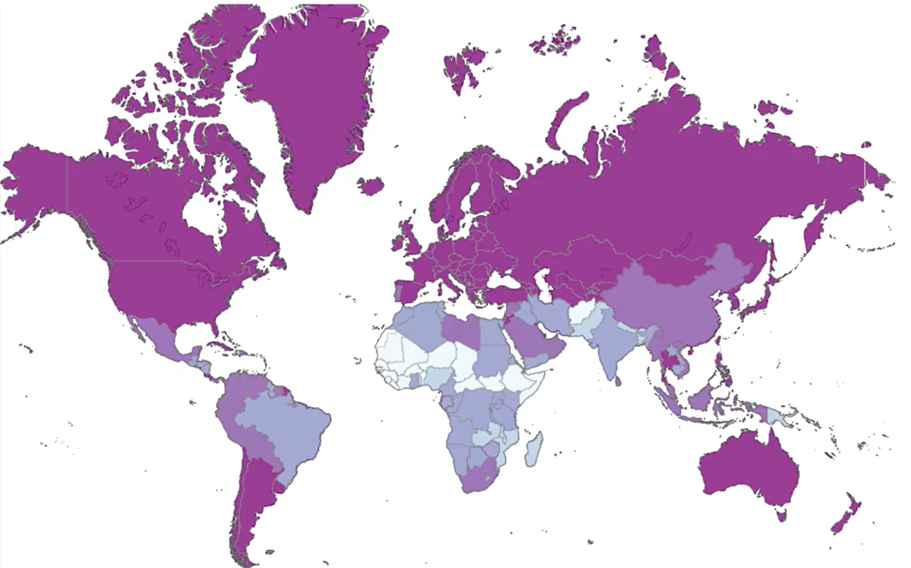
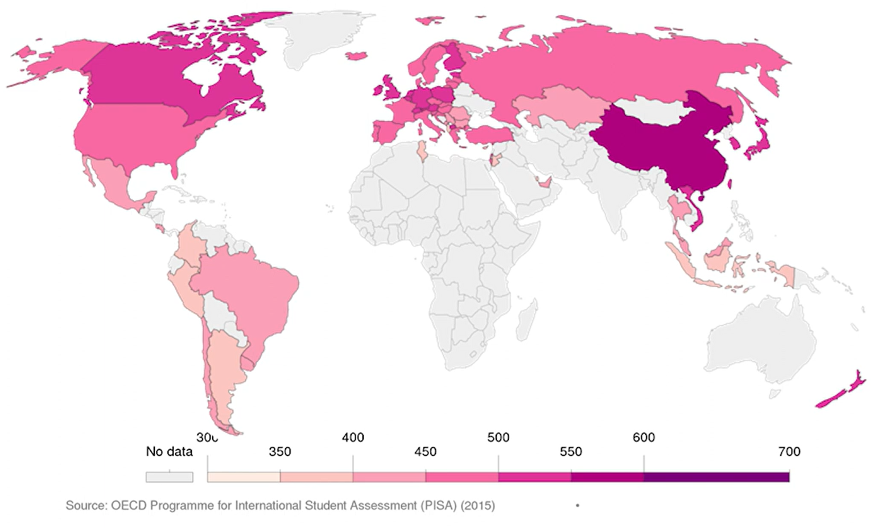
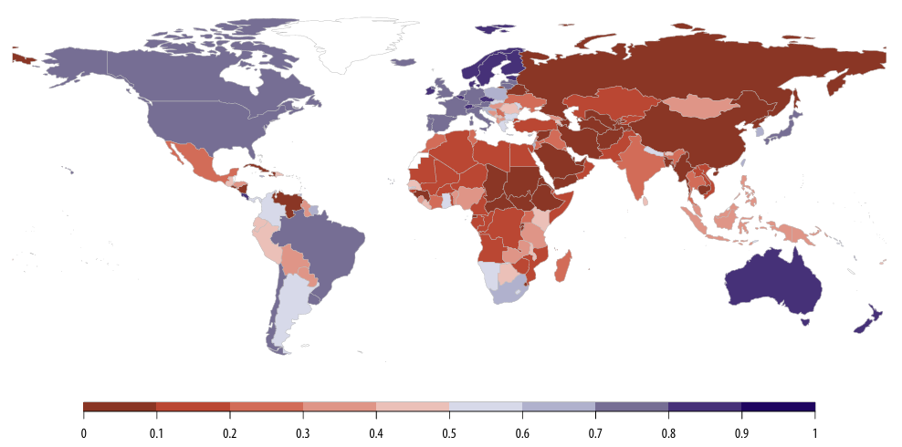
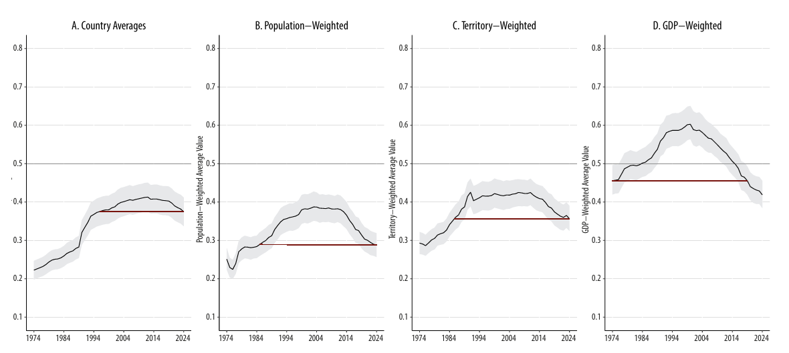
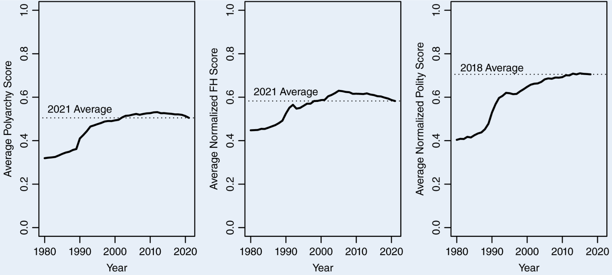
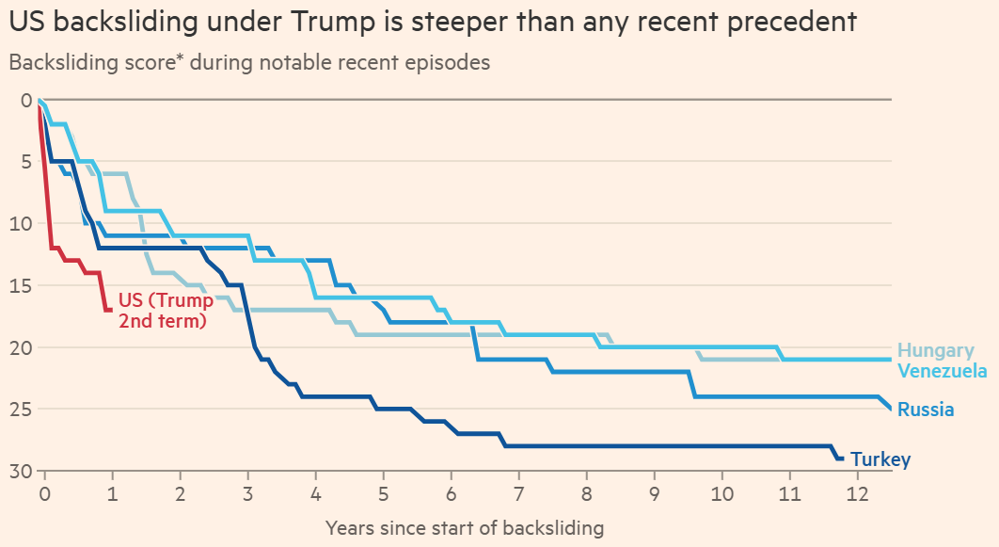

------------------------------------------------------------------------

## Welcome

Today’s goals:

-   Recap the core points from this week's videos
-   Work through a group discussion on **measuring democracy**

------------------------------------------------------------------------

## Example: Education levels and democratisation

-   **Research question:** Do higher levels of education make countries more likely to democratise?

------------------------------------------------------------------------

## Level of education

-   How do we know if a country's **level of education** is high or low?
-   What information do we collect?
-   We should start by figuring out a **definition** for the level of education.

------------------------------------------------------------------------

## Defining the level of education

-   **Accessibility** of basic education to all citizens?
-   **Proficiency** of students in reading, math, and science?
-   The **implications** for research are not trivial!

------------------------------------------------------------------------

## From definition to measurement

-   A measurement for **accessibility:** Literacy rates.

    -   A good (but not perfect) approximation.

-   A measurement for **proficiency:** Students' standardised exam scores.

    -   PISA (Programme for International Student Assessment).

------------------------------------------------------------------------

## Literacy rates

{fig-cap="" fig-align="center" width="80%"}

------------------------------------------------------------------------

## PISA scores

{fig-cap="" fig-align="center" width="80%"}

------------------------------------------------------------------------

## From education to democracy

-   **Research question:** Is there a global trend towards democratic backsliding?
-   A pressing contemporary debate that highlights the importance of measurement choices.
-   Recent debates focus on a particular measurement: **Varieties of Democracy (V-DEM)**.

------------------------------------------------------------------------

## Varieties of Democracy (V-DEM)

-   Democracy measured as an **interval** variable (countries are given scores between 0 and 1)
-   Sends questionnaires to over **3,700** country experts.
-   Questions about several indicators deemed necessary to determine if a country is democratic.

------------------------------------------------------------------------

## The V-DEM world map

{fig-cap="" fig-align="center" width="80%"}

[Source](https://www.v-dem.net/documents/60/V-dem-dr__2025_lowres.pdf)

------------------------------------------------------------------------

## Is democracy backsliding? According to V-DEM, yes!

{fig-cap="" fig-align="center" width="80%"}

[Source](https://www.v-dem.net/documents/60/V-dem-dr__2025_lowres.pdf)

------------------------------------------------------------------------

## Is democracy backsliding? According to other indicators, no!

{fig-cap="" fig-align="center" width="80%"}

[Source](https://www.cambridge.org/core/journals/ps-political-science-and-politics/article/measuring-democratic-backsliding/9EE2044CDA598BD815349912E61189D8)

------------------------------------------------------------------------

## The critique: Little & Meng (2024) on V-Dem

- V-Dem relies heavily on **expert judgments**, which may shift over time even if underlying political institutions do not. 

- Changes in expert **expectations** or **standards** can look like changes in democracy.

- As an alternative, Little and Meng argue for focusing on indicators of democracy that are less sensitive to **subjective interpretation**.

------------------------------------------------------------------------

## What does their alternative look like?

[Little and Meng (2024)](https://www.cambridge.org/core/journals/ps-political-science-and-politics/article/measuring-democratic-backsliding/9EE2044CDA598BD815349912E61189D8) propose measuring democracy using indicators as:

- Whether incumbents and ruling parties **lose elections** and **accept defeat**.

- The degree of electoral competition, including **vote shares** and **seat shares** of winning parties.

- The presence and enforcement of formal institutional constraints, such as **term limits** and **succession rules**.

------------------------------------------------------------------------

## The counter-critique: V-DEM's side

Scholars associated with V-Dem [respond that](https://www.v-dem.net/media/publications/wp_140.pdf):

- Democracy is inherently **multidimensional** and cannot be adequately captured by a narrow set of observable outcomes.

- Indicators presented as “objective” by Little and Meng still involve **coding decisions** and **theoretical assumptions**; they are not free from subjectivity.

- Expert-based measures are not a feature, not a bug for measuring **complex political concepts**.

------------------------------------------------------------------------

## Group activity: How to measure democracy?

- In small groups, **discuss** the debate you have just seen.

- Your task is not to decide whether democracy is declining, but to decide which approach to measurement you find **more convincing**.

- Focus on the **trade-offs** between expert judgment and more “objective” indicators, and on what each approach can and cannot capture.

------------------------------------------------------------------------

## Guiding questions for discussion

- Which critique or defense do you find more persuasive, and **why**?

- What do you think is lost when we move away from **expert judgments**?

- What do you think is lost when we rely heavily on **subjective assessments**?

- If you had to choose one approach to answer the question of **democratic backsliding**, which would you choose?

------------------------------------------------------------------------

## Share your thoughts

- [Click here](https://www.menti.com/alp5xzysmysp), scan the QR code, or join at menti.com using the code **2173 3787**

{fig-cap="" fig-align="center" width="50%"}

------------------------------------------------------------------------

## Dig Deeper

- [How steep is Trump’s democratic backsliding?](https://www.ft.com/content/b474855e-66b0-4e6e-9b73-7e252bd88938) 

    - Financial Times, 31 Jan 2026 (Access with your King's email account).

- [Methodology](https://docs.google.com/document/d/e/2PACX-1vTNz8J13MV_ZLQ8BT-AsRNTn4lADHidb3KRYpuQ7ZiA895SgDGwz2PaCi3KQeHpEdjcOMUl4bVs6qNn/pub) reviewed by Anne Meng.

{fig-cap="" fig-align="center" width="67%"}

------------------------------------------------------------------------

## Why this matters

- Measurement choices are **not neutral**. They shape what we see in the data and the conclusions we draw from it.

- Different **definitions** and **measurements** of the same concept can lead to very different **answers** to the same research question.

