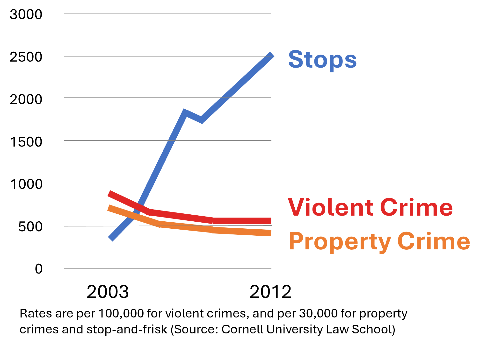
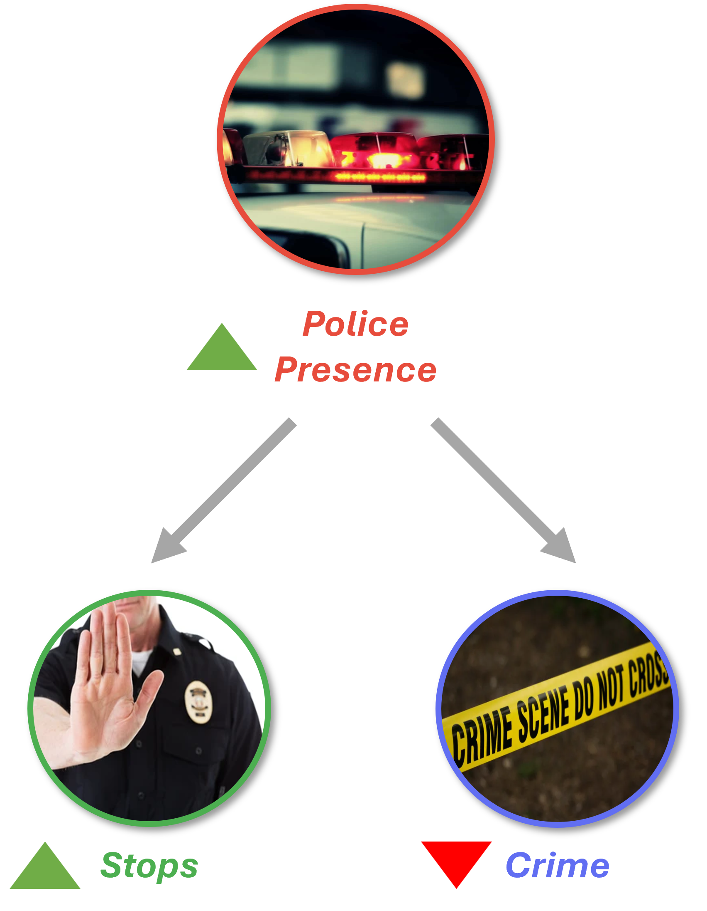

------------------------------------------------------------------------

## From the concept videos to the lecture

- The videos introduced **confounding variables** and **reverse causality**.
- Today we apply confounding to a real policy debate.
- The question: did **stop-and-frisk** reduce crime in New York City?

------------------------------------------------------------------------

## Stop-and-frisk

- NYPD officers stopped, questioned, and frisked pedestrians on suspicion of crime.
- At its peak in 2011: **685,724 recorded stops**.
- 88% of those stopped were found innocent. 53% were Black; 34% were Latinx.

Source: [NYCLU](https://www.nyclu.org/en/stop-and-frisk-data)

------------------------------------------------------------------------

## The claim

- Between 2003 and 2012, police stops increased and violent crime declined.
- Mayor Bloomberg and Police Commissioner Kelly argued stop-and-frisk **caused** the crime decline.
- This was their justification for continuing and expanding the policy.

------------------------------------------------------------------------

## The correlation

{fig-align="center" width="80%"}

------------------------------------------------------------------------

## Class activity

- Stops rose sharply from 2003 to 2012, and crime fell over the same period.
- **Does this mean stop-and-frisk caused the decline?**
- What other variables might explain this pattern?

------------------------------------------------------------------------

## Class activity {visibility="uncounted"}

{fig-align="center" width="80%"}

------------------------------------------------------------------------

## Police presence as a confounder

- During the same period, the NYPD ran **Operation Impact**.
- More police presence → more stops **and** less crime.
- Police presence affects both the independent and dependent variable.

------------------------------------------------------------------------

## The confounding structure

{fig-align="center" width="80%"}

------------------------------------------------------------------------

## MacDonald et al. (2016)

- Used a **difference-in-differences** design (DiD).
- Compared impact zones to similar nearby blocks **not** designated.
- Measured the **change** in crime in both groups, not absolute levels.

[MacDonald, Fagan & Geller (2016), *PLOS ONE*](https://doi.org/10.1371/journal.pone.0157223)

------------------------------------------------------------------------

## How do we know it was presence?

- Bloomberg and Kelly compared crime **before and after** across the whole city.
- City-wide trends (e.g. economic recovery) could explain the decline.
- DiD asks: did crime **fall more** in impact zones than in similar blocks?

------------------------------------------------------------------------

## Presence vs. stops

- Impact zones saw a **larger drop** in crime than comparable blocks.
- Zones with more stops did **not** see additional crime reductions.
- The effect came from officers being there, not from stopping people.

------------------------------------------------------------------------

## Why this matters

- 88% of stops were innocent; 87% of those stopped were Black or Latinx.
- Omitted variable bias caused real harm, not just analytic error.
- **Data literacy makes good citizens.**

