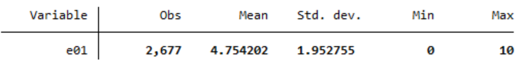
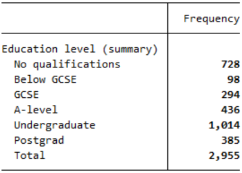

# Types of Variables {.title-left}

<iframe width="560" height="315" src="https://www.youtube.com/embed/nCVu3XtdRJI?si=ljKFbQ3DE1JtisHi" title="YouTube video player" frameborder="0" allow="accelerometer; autoplay; clipboard-write; encrypted-media; gyroscope; picture-in-picture; web-share" referrerpolicy="strict-origin-when-cross-origin" allowfullscreen></iframe>

------------------------------------------------------------------------

## You'll learn to

::: presenter-space
-   **Classify** variables by type.
-   **Evaluate** how different types lead to different summaries.
:::

------------------------------------------------------------------------

## Example: British Election Study, 2024

::: presenter-space
-   What is your **age**?
-   On a **0-10 scale**, where 0 means left and 10 means right, where would you place yourself?
-   What is the highest **qualification** you have?
-   Which **party** did you vote for in the general election?
:::

------------------------------------------------------------------------

## Age

::: presenter-space

::: nonincremental

-   **What is your age?**

:::

:::

------------------------------------------------------------------------

## Age

::: presenter-space
-   Answers are **numeric quantities**.
-   Has a true zero, and a 40-year-old is twice as old as a 20-year-old.
-   Age is a **ratio variable.**
:::

------------------------------------------------------------------------

## Ratio variables

::: presenter-space
-   **Ratio** variables come in quantities that have a true zero.
    
    -   Additional examples: A country's GDP; A country's population; A person's income.
    
-   We **can** compute the mean and make mathematical operations with a ratio variable.

    -   Eg., Dividing a country's GDP by its population to compute the GDP per capita.
:::

<!-- ------------------------------------------------------------------------ -->

<!-- ## Example: British Election Study, 2024 -->

<!-- :::: presenter-space -->
<!-- ::: nonincremental -->
<!-- -   What is your age? -->
<!-- -   **On a 0-10 scale, where 0 means left and 10 means right, where would you place yourself?** -->
<!-- -   What is the highest qualification you have? -->
<!-- -   Which party did you vote for in the general election? -->
<!-- ::: nonincremental -->
<!-- :::: -->

------------------------------------------------------------------------

## Ideology

::: presenter-space

::: nonincremental

-   **On a 0-10 scale, where 0 means left and 10 means right, where would you place yourself?**

:::

:::

------------------------------------------------------------------------

## Ideology

::: presenter-space
-   Answers are **numeric quantities**.
-   Does not have a true zero; a four does not mean "twice as much to the right" than a two.
-   Ideology is an **interval variable.**
:::

------------------------------------------------------------------------

## Interval variables

::: presenter-space
-   **Interval** variables come in quantities that do not have a true zero.
    
    -   Additional examples: Temperature (Celsius/Fahrenheit); a person's credit score.
    
-   We **can** compute the mean of an interval variable, but cannot make certain mathematical operations with it.

:::

------------------------------------------------------------------------

<!-- ## Example: British Election Study, 2024 -->

<!-- :::: presenter-space -->
<!-- ::: nonincremental -->
<!-- -   What is your age? -->
<!-- -   On a 0-10 scale, where 0 means left and 10 means right, where would you place yourself? -->
<!-- -   **What is the highest qualification you have?** -->
<!-- -   Which party did you vote for in the general election? -->
<!-- ::: -->
<!-- :::: -->

------------------------------------------------------------------------

## Education level

::: presenter-space

::: nonincremental

-   **What is the highest qualification you have?**

:::

:::

------------------------------------------------------------------------

## Education level

::: presenter-space
-   Answers are **categories** (not quantities).
-   These categories are ordered.
-   The education level is an **ordinal variable.**
:::

------------------------------------------------------------------------

## Ordinal variables

::: presenter-space
-   **Ordinal variables** come in categories that are ranked in a specific order.
    
    -   Additional examples: How strongly a person agrees with a statement.
    
-   We **can** compute the means of certain ordinal variables, but interpreting them demands added caution.
:::

<!-- ------------------------------------------------------------------------ -->

<!-- ## Example: British Election Study, 2024 -->

<!-- :::: presenter-space -->
<!-- ::: nonincremental -->
<!-- -   What is your age? -->
<!-- -   On a 0-10 scale, where 0 means left and 10 means right, where would you place yourself? -->
<!-- -   What is the highest qualification you have? -->
<!-- -   **Which party did you vote for in the general election?** -->
<!-- ::: -->
<!-- :::: -->

------------------------------------------------------------------------

## General Election vote

::: presenter-space

::: nonincremental

-   **Which party did you vote for in the general election?**

:::

:::

------------------------------------------------------------------------

## General Election vote

::: presenter-space
-   Answers are **categories** (not quantities).
-   Categories **cannot** be ordered.
-   The General Election vote is a **nominal variable.**
:::

------------------------------------------------------------------------

## Nominal variables

::: presenter-space
-   **Nominal variables** come in categories that cannot be ranked.
    
    -   Additional examples: A person's gender; a country's electoral system type.
    
-   We **cannot** compute the mean or draw a histogram for a nominal variable.
:::

------------------------------------------------------------------------

## Recap

::: presenter-space
-   Variables differ in the **kind of information** they carry.
-   The type of a variable **constrains** which summaries and comparisons make sense.
:::

------------------------------------------------------------------------

::: presenter-space
**Why this matters:**

-   Misclassifying variables leads to incorrect interpretation, not just technical mistakes.
-   Our choices of graphs, models, and statistical tests depend on variable type.
:::
