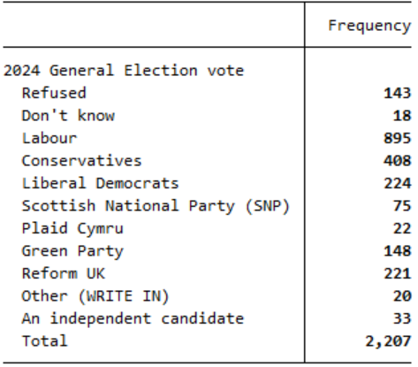
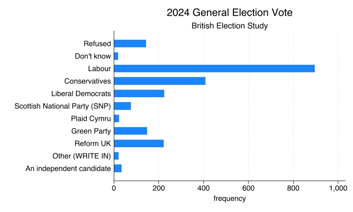
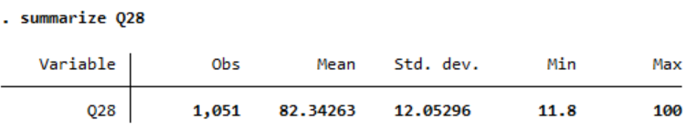
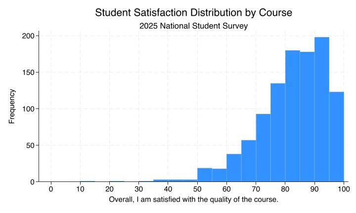
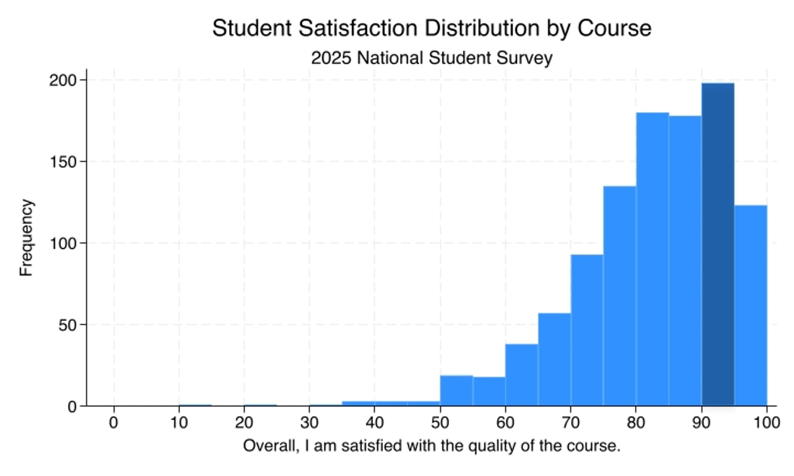
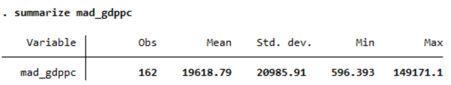
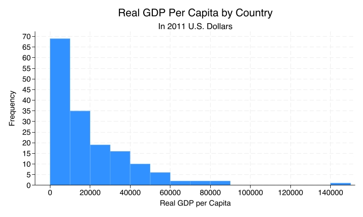
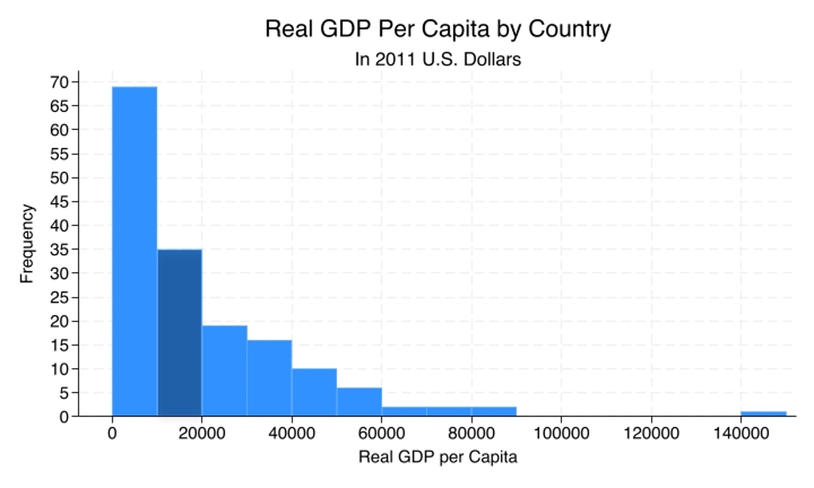

# Bar Charts and Histograms {.title-left}

<iframe width="560" height="315" src="https://www.youtube.com/embed/rKMQZJYWNhQ" title="YouTube video player" frameborder="0" allow="accelerometer; autoplay; clipboard-write; encrypted-media; gyroscope; picture-in-picture; web-share" referrerpolicy="strict-origin-when-cross-origin" allowfullscreen></iframe>

------------------------------------------------------------------------

## You'll learn to

::: presenter-space
-   Choose and interpret **bar charts** and **histograms** for univariate data.
:::

------------------------------------------------------------------------

## General Election vote: Frequency table

::: presenter-space

::: nonincremental

Which party did you vote for in the general election?

{fig-align="center"}

:::

:::

------------------------------------------------------------------------

## General Election vote: Frequency bar chart

::: presenter-space

::: nonincremental

{fig-align="center"}

:::

:::

------------------------------------------------------------------------

## Frequency bar charts

::: presenter-space
- Good for visualising distributions of **nominal** variables.
- Shows how many observations are in each **category**.
- The order of the bars does **not** make a difference.
:::

------------------------------------------------------------------------

## NSS Data: Summary

::: presenter-space

::: nonincremental

Q28: Overall, I am satisfied with the quality of the course

<!-- {fig-align="center"} -->

| Q28       |       |
|-----------|-------|
| Obs       | **1,051** |
| Mean      | **82.3**  |
| Std. dev. | **12**    |
| Min       | **11.8**  |
| Max       | **100**   |

:::

:::

------------------------------------------------------------------------

## NSS Data: Histogram

::: presenter-space

::: nonincremental

{fig-cap="" fig-align="center" width="80%"}

:::

:::

------------------------------------------------------------------------

## NSS Data: Histogram

::: presenter-space

::: nonincremental

{fig-cap="" fig-align="center" width="80%"}

About **200** courses between 90% and 95% satisfaction rates.

:::

:::

------------------------------------------------------------------------

## Histograms

::: presenter-space
- Good for visualising distributions of **ordinal**, **interval**, and **ratio** variables.
- Shows how many observations are in each **range** of values.
- The order of the bars **does** make a difference.
:::

------------------------------------------------------------------------

## Another variable: GDP per capita

::: presenter-space

| Country  | GDP per capita  |
|----------|-----------------|
| USA      | **$58.4k**      |
| UK       | **$38.4k**      |
| China    | **$19.2k**      |
| Brazil   | **$14.6k**      |
| India    | **$7.7k**       |
| Ethiopia | **$2.3k**       |

:::

------------------------------------------------------------------------

## GDP per capita: summary

::: presenter-space

::: nonincremental

| GDPpc     |         |
|-----------|---------|
| Obs       | **162**     |
| Mean      | **19,619**  |
| Std. dev. | **20,986**  |
| Min       | **596**     |
| Max       | **149,171** |

<!-- {fig-align="center"} -->

:::

:::

------------------------------------------------------------------------

## GDP per capita: Histogram

::: presenter-space

::: nonincremental

{fig-align="center"}

:::

:::

------------------------------------------------------------------------

## GDP per capita: Histogram

::: presenter-space

::: nonincremental

{fig-cap="" fig-align="center" width="80%"}

**35** countries between \$10k and \$20k.

:::

:::

------------------------------------------------------------------------

## Recap

::: presenter-space
- **Bar charts** and **histograms** visualise distributions.
- Bar charts are used for **nominal** variables and show counts by category.
- Histograms are used for **ordinal**, **interval**, and **ratio** variables and show counts within ranges of values.
:::

------------------------------------------------------------------------

::: presenter-space
**Why this matters:**

- The wrong type of graph can obscure patterns or suggest structure that is not there.
- The right visualisation helps us see what is typical, what is rare, and how values are distributed.
:::
