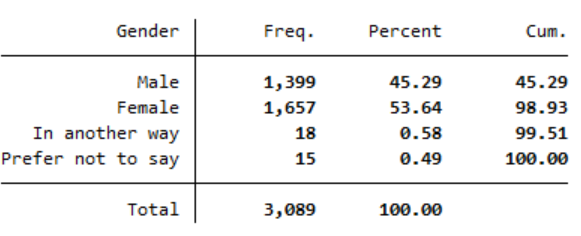
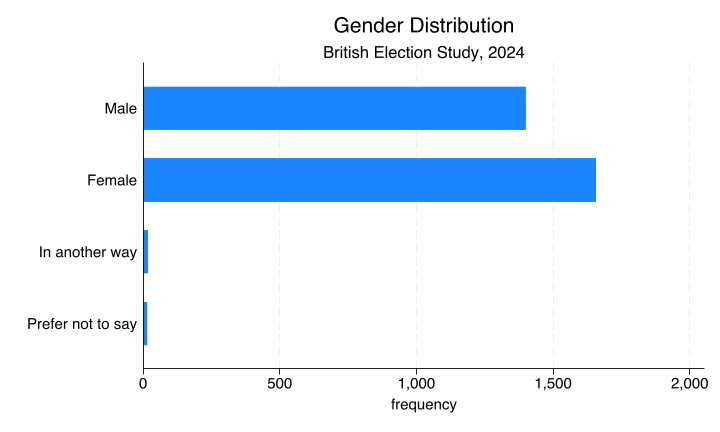
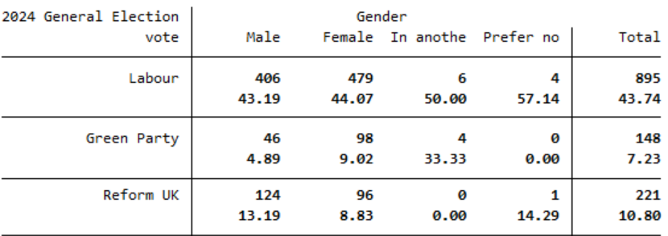
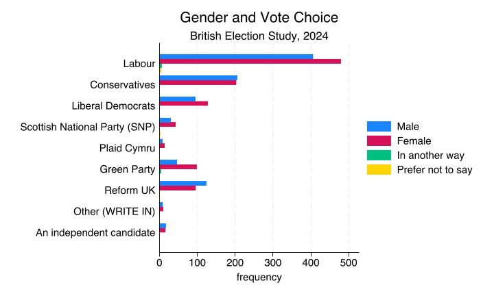

# Correlations Between Nominal Variables {.title-left}

<iframe width="560" height="315" src="https://www.youtube.com/embed/hlRTjcbp-4Q" title="YouTube video player" frameborder="0" allow="accelerometer; autoplay; clipboard-write; encrypted-media; gyroscope; picture-in-picture; web-share" referrerpolicy="strict-origin-when-cross-origin" allowfullscreen></iframe>

------------------------------------------------------------------------

## You'll learn to

::: presenter-space
-   Describe associations between two categorical variables using **cross-tabulations** and **bivariate frequency charts**.
:::

------------------------------------------------------------------------

## General Election vote: Frequency table

::: presenter-space

::: nonincremental

Which **party** did you vote for in the general election?

{fig-cap="" fig-align="center" width="80%"}

<!-- | 2024 General Election vote    | Frequency | Percent    | -->
<!-- | ----------------------------- | --------- | ---------- | -->
<!-- | Refused                       | 143       | 6.48       | -->
<!-- | Don’t know                    | 18        | 0.82       | -->
<!-- | Labour                        | 895       | 40.55      | -->
<!-- | Conservatives                 | 408       | 18.49      | -->
<!-- | Liberal Democrats             | 224       | 10.15      | -->
<!-- | Scottish National Party (SNP) | 75        | 3.40       | -->
<!-- | Plaid Cymru                   | 22        | 1.00       | -->
<!-- | Green Party                   | 148       | 6.71       | -->
<!-- | Reform UK                     | 221       | 10.01      | -->
<!-- | Other (WRITE IN)              | 20        | 0.91       | -->
<!-- | An independent candidate      | 33        | 1.50       | -->
<!-- | **Total**                     | **2,207** | **100.00** | -->

:::

:::

------------------------------------------------------------------------

## General Election vote: Frequency bar chart

::: presenter-space

::: nonincremental

{fig-cap="" fig-align="center" width="80%"}

:::

:::

------------------------------------------------------------------------

## Another nominal variable: Gender

::: presenter-space

::: nonincremental

{fig-cap="" fig-align="center" width="80%"}

:::

:::

------------------------------------------------------------------------

## Another nominal variable: Gender

::: presenter-space

::: nonincremental

{fig-cap="" fig-align="center" width="80%"}

:::

:::

------------------------------------------------------------------------

## Gender and vote: How do they correlate?

::: presenter-space

- Do men and women **vote** differently?
- If so, for which **parties** do we see the biggest gaps?

:::

------------------------------------------------------------------------

## Correlations between variables

::: presenter-space

- Two variables are **correlated** if knowing the value of one variable tells you something about the likely value of the other.
- For **gender** and **vote**: if men and women vote similarly, there's no correlation. If they vote differently, there is a correlation.

:::

------------------------------------------------------------------------

## Gender and vote: cross table

::: presenter-space

::: nonincremental

{fig-cap="" fig-align="center" width="80%"}

:::

:::

------------------------------------------------------------------------

## Gender and vote: cross table

::: presenter-space

- For **Labour**: 479 women (44%) vs 406 men (43.2%) — similar.
- For **Green**: 98 women (9%) vs 46 men (4.9% ) — women more likely.
- For **Reform**: 96 women (8.8%) vs 124 men (13.2%) — men more likely.

:::

------------------------------------------------------------------------

## Gender and vote: bivariate frequency chart

::: presenter-space

::: nonincremental

{fig-align="center"}

:::

:::

------------------------------------------------------------------------

## Interpreting the gender gap

::: presenter-space

- In the bar chart, the **count difference** for Labour (73 more women) looks larger than for Green (52 more women).
- But the **percentage difference** is actually smaller for Labour (0.8 points) than for Green (4.1 points).
- Use **percentages**, not counts, to compare group likelihoods.

:::

------------------------------------------------------------------------

## Recap

::: presenter-space

- When both variables are **nominal**, use bivariate frequency charts and cross-tabulation to analyse if they are correlated.
- When comparing groups, focus on **percentages** rather than raw counts to assess relative likelihoods.

:::

------------------------------------------------------------------------

::: presenter-space
**Why this matters:**

- Describing associations is the first step toward asking why they exist (e.g., why do men vote differently than women?)

:::
