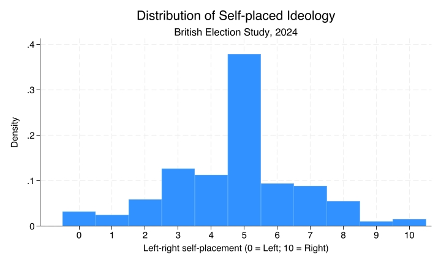
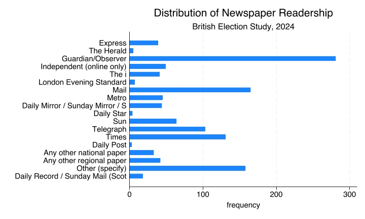
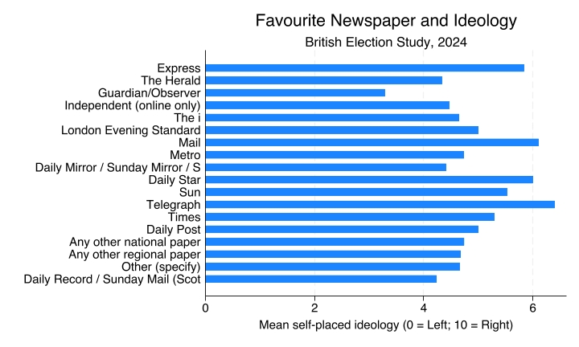

# Comparing Means by Category {.title-left}

------------------------------------------------------------------------

## You'll learn to

::: presenter-space
-   Summarise differences between groups by **comparing group means**.
:::

------------------------------------------------------------------------

## Political preferences (Left-right self-placement)

::: presenter-space

::: nonincremental

- Mean: **4.75**

{fig-cap="" fig-align="center" width="80%"}

:::

:::

------------------------------------------------------------------------

## Newspaper readership

::: presenter-space

::: nonincremental

- Mode: **Guardian/Observer** - 281 readers (22.8%)

{fig-cap="" fig-align="center" width="80%"}

:::

:::

------------------------------------------------------------------------

## Political preferences and choice of newspaper

::: presenter-space

- Different **media outlets** report the news with different perspectives.
- Do these differences reflect the **political preferences** of their readers?

:::

------------------------------------------------------------------------

## Correlations between variables

::: presenter-space

- Two variables are **correlated** if knowing the value of one variable tells you something about the likely value of the other.
- If readers of different newspapers have similar preferences, there's no correlation. If their preferences differ, there is a correlation.

:::

------------------------------------------------------------------------

## Newspaper and preferences: bar chart

::: presenter-space

::: nonincremental

{fig-align="center"}

:::

:::

------------------------------------------------------------------------

## Newspaper and preferences: comparing means

::: presenter-space

::: nonincremental

| Newspaper         | Mean left-right self-placement |
|-------------------|-------------------------------|
| Guardian/Observer | **3.29**                          |
| Independent       | **4.47**                          |
| Times             | **5.29**                          |
| Daily Mail        | **6.1**                           |
| Telegraph         | **6.4**                           |

:::

:::

------------------------------------------------------------------------

## Recap

::: presenter-space

- When one variable is **nominal** and the other is **numeric** (interval or ratio), compare the mean of the numeric variable across categories.
- A **bar chart with means** shows how the average value differs between groups.
- Larger differences between group means suggest a stronger association between the variables.

:::

------------------------------------------------------------------------

::: presenter-space
**Why this matters:**

- Describing group differences is the foundation for asking why those differences exist.

:::
