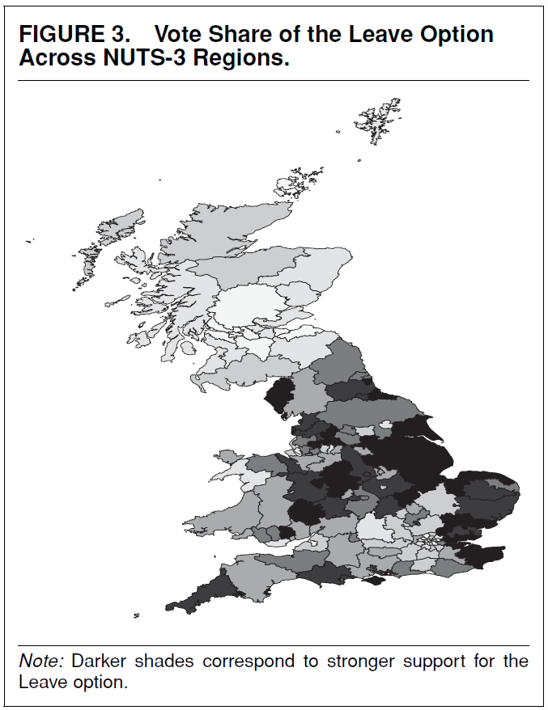
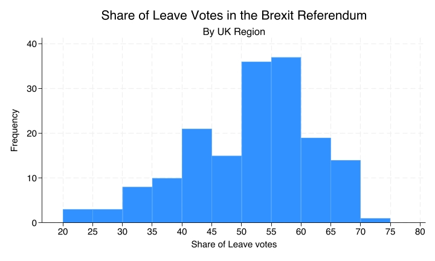
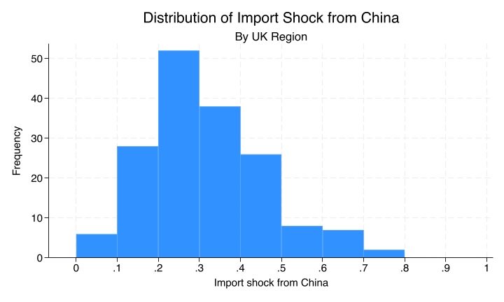
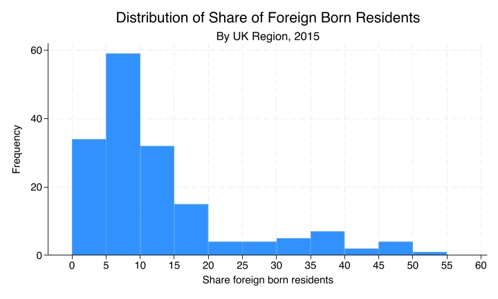
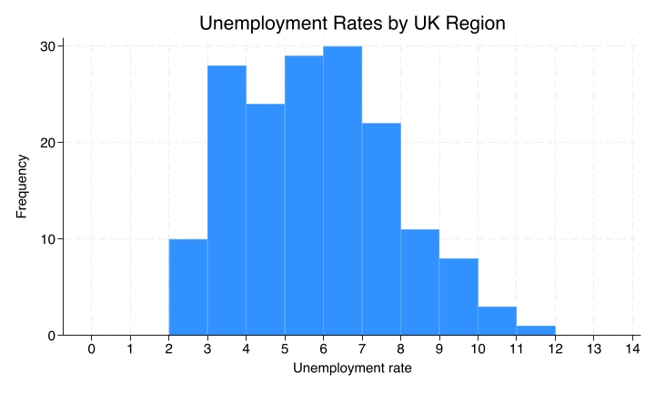
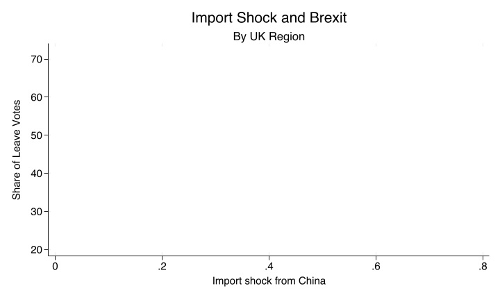
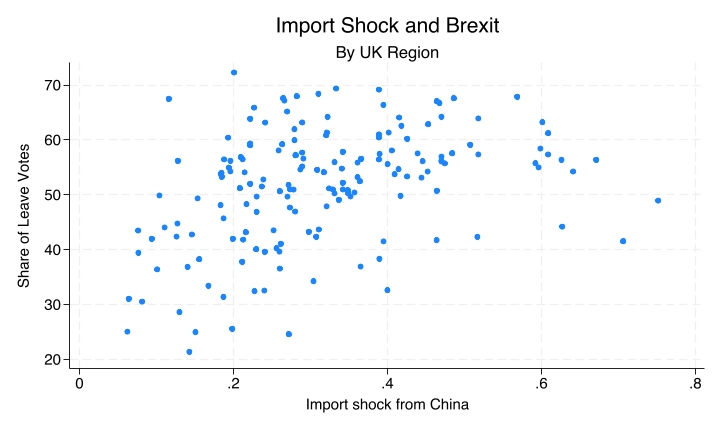
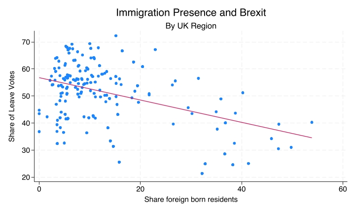
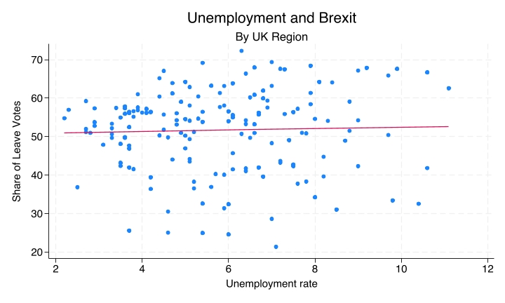

# Scatterplots and Regression Lines {.title-left}

------------------------------------------------------------------------

## You'll learn to

::: presenter-space
-   Interpret **scatterplots** and **regression lines** to analyse correlations between numeric variables.
:::

------------------------------------------------------------------------

## Support for Brexit across UK regions

::: presenter-space

::: nonincremental

{fig-cap="" fig-align="center" width="40%"}

[Source](https://www.cambridge.org/core/journals/american-political-science-review/article/global-competition-and-brexit/C843990101DB9232B654E77130F88398)

:::

:::

------------------------------------------------------------------------

## What variables are correlated with support for Brexit?

::: presenter-space

::: nonincremental

{fig-cap="" fig-align="center" width="80%"}

:::

:::

------------------------------------------------------------------------

## Competition from imports?

::: presenter-space

::: nonincremental

{fig-cap="" fig-align="center" width="80%"}

:::

:::

------------------------------------------------------------------------

## Immigration presence?

::: presenter-space

::: nonincremental

{fig-cap="" fig-align="center" width="80%"}

:::

:::

------------------------------------------------------------------------

## Unemployment rates?

::: presenter-space

::: nonincremental

{fig-cap="" fig-align="center" width="80%"}

:::

:::

------------------------------------------------------------------------

## Correlations between variables

::: presenter-space

- Two variables are **correlated** if knowing the value of one variable tells you something about the likely value of the other.
- If import shock tells us nothing about Leave support, there's no correlation. If regions with higher import shock tend to have different Leave support, there is a correlation.

:::

------------------------------------------------------------------------

## Setting up the scatterplot

::: presenter-space

::: nonincremental

{fig-cap="" fig-align="center" width="80%"}

:::

:::

------------------------------------------------------------------------

## Each dot is a region

::: presenter-space

::: nonincremental

{fig-cap="" fig-align="center" width="80%"}

:::

:::

------------------------------------------------------------------------

## The regression line summarises the pattern

::: presenter-space

- With so many points, it's hard to see the overall pattern at a glance.
- The **regression line** is the line that best summarises the relationship.
- An **upward** slope means the variables tend to move together; a **downward** slope means they move in opposite directions.

:::

------------------------------------------------------------------------

## Import shock and Brexit

::: presenter-space

::: nonincremental

- Import shock and share of leave votes: **positive correlation**.

{fig-cap="" fig-align="center" width="80%"}

:::

:::

------------------------------------------------------------------------

## Immigration and Brexit

::: presenter-space

::: nonincremental

- The downward-sloping line shows a **negative correlation**.

{fig-cap="" fig-align="center" width="80%"}

:::

:::

------------------------------------------------------------------------

## Unemployment and Brexit

::: presenter-space

::: nonincremental

- A flat line indicates **no correlation**.

{fig-cap="" fig-align="center" width="80%"}

:::

:::

------------------------------------------------------------------------

## Recap

::: presenter-space

- When both variables are **numeric** (interval or ratio), use scatterplots to show their relationship by plotting each observation as a point.
- The **regression line** summarises the overall pattern.

:::

------------------------------------------------------------------------

::: presenter-space
**Why this matters:**

- Scatterplots and regression lines are common tools for analysing whether and how numeric variables are correlated.

:::
