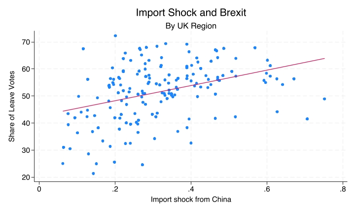

# From Variable Types to Plots and Tables {.title-left}

<iframe width="560" height="315" src="https://www.youtube.com/embed/rW-OWCudl1I" title="YouTube video player" frameborder="0" allow="accelerometer; autoplay; clipboard-write; encrypted-media; gyroscope; picture-in-picture; web-share" referrerpolicy="strict-origin-when-cross-origin" allowfullscreen></iframe>

------------------------------------------------------------------------

## You'll learn to

::: presenter-space
-   Choose appropriate tables, plots, and summary statistics based on the **types of variables** being analysed.
:::

------------------------------------------------------------------------

## The decision rule

::: presenter-space

1. **Identify** the types of variables you're working with.
2. **Choose** the appropriate descriptive tool based on those types.

:::

::: notes
<!-- This is the central principle of the video. Students should always start with variable types, then select tools. This prevents the common mistake of asking software for inappropriate plots or tables. -->
:::

------------------------------------------------------------------------

## Variable types: A quick reminder

::: presenter-space

- **Nominal**: Categories with no inherent order (e.g., party voted for, gender, region).
- **Numeric**: Variables measured on a scale with meaningful intervals or ratios.
  - Includes **interval** variables.
  - Includes **ratio** variables.

:::

::: notes
<!-- Students should already know these from Week 3. The key clarification here is making "numeric" explicit: interval + ratio = numeric for the purposes of choosing descriptive tools. We're not re-teaching measurement theory—just making the operational definition clear. -->
:::

------------------------------------------------------------------------

## Three cases to memorise

::: presenter-space

When describing correlations between **two variables**, you need to know:

1. **Nominal + Nominal**
2. **Nominal + Numeric**
3. **Numeric + Numeric**

:::

::: notes
<!-- This slide sets up the structure. The next three slides will present each case in turn. Students should think of this as a decision tree: look at your variables, identify which case applies, then use the appropriate tool. -->
:::

------------------------------------------------------------------------

## Case 1: Nominal + Nominal

::: presenter-space

- **Example:** Gender and vote choice.
- Tools:

    - **Cross-tabulation** (with row or column percentages)
    - **Bivariate bar chart**

:::

::: notes
<!-- Remind students they saw this in C10. The key is comparing proportions across categories. Cross-tabs show the numbers; bivariate bar charts visualise the pattern. Emphasise that percentages (not counts) are essential for interpretation. -->
:::

------------------------------------------------------------------------

## Case 1: Nominal + Nominal (example)

::: presenter-space

::: nonincremental

|         | Women | Men |
| ------- | ----- | --- |
| Labour  | **44%**   | **43%** |
| Cons    | **19%**   | **22%** |
| Lib Dem | **12%**   | **10%** |
| Green   | **9%**    | **5%**  |
| Reform  | **9%**    | **13%** |

:::

:::

::: notes
<!-- This is a simplified version of the gender-vote cross-tab from C10. The point is to show students what the output looks like and how to read it. The interpretation focuses on percentage differences. -->
:::

------------------------------------------------------------------------

## Case 2: Nominal + Numeric

::: presenter-space

- **Example:** Favourite newspaper and political preferences.
- Tools:

    - **Compare means** by category
    - **Bar chart of means**

:::

::: notes
<!-- Remind students they saw this in C11. When one variable is categorical and the other is on a numeric scale, compare the average value of the numeric variable across categories. This is different from Case 1 because we're not counting frequencies—we're summarising a numeric variable within groups. -->
:::

------------------------------------------------------------------------

## Case 2: Nominal + Numeric (example)

::: presenter-space

::: nonincremental

| Newspaper         | Mean left-right self-placement |
|-------------------|-------------------------------|
| Guardian/Observer | **3.29**                          |
| Independent       | **4.47**                          |
| Times             | **5.29**                          |
| Daily Mail        | **6.1**                           |
| Telegraph         | **6.4**                           |

:::

:::

::: notes
<!-- Generic example to illustrate the principle. Students should see that we're comparing a single number (the mean) across categories, not frequencies or percentages. The bar chart would show these three means as bar heights. -->
:::

------------------------------------------------------------------------

## Case 3: Numeric + Numeric

::: presenter-space

- **Example:** Import shock and Brexit
- **Tools:**

    - **Scatterplot**
    - **Regression line**

:::

::: notes
<!-- Remind students they saw this in C12. When both variables are numeric, we can plot each observation as a point and summarise the relationship with a line. The slope tells us direction (positive/negative correlation); the scatter tells us strength. -->
:::

------------------------------------------------------------------------

## Case 3: Numeric + Numeric (example)

::: presenter-space

::: nonincremental

- Import shock and share of leave votes: **positive correlation**.

{fig-cap="" fig-align="center" width="80%"}

:::

:::

::: notes
<!-- This slide would show a generic scatterplot with a positive slope. The point is visual recognition: students should see two numeric axes, dots representing observations, and a line summarising the trend. If the scatter_example.jpg asset doesn't exist, you can use a placeholder or create one—the key is showing the visual structure. -->
:::

------------------------------------------------------------------------

## A common mistake: Wrong tool for variable types

::: presenter-space

- **Problem:** Using a scatterplot for nominal + nominal variables.
- **Example:** Plotting "gender" (coded 1 = male, 2 = female) against "party voted for" (coded 1 = Labour, 2 = Conservative, etc.).

:::

::: notes
<!-- This is the "bad match" example. Students often treat numeric codes as if they were actual numbers. Gender coded as 1/2 is still nominal—the numbers are arbitrary labels. A scatterplot would be meaningless because the axes don't represent quantities. -->
:::

------------------------------------------------------------------------

## Why this is a problem

::: presenter-space

- The **numeric codes** are arbitrary; they don't represent quantities.
- A scatterplot implies a continuous relationship, but there's **no meaningful distance** between "male" and "female" or between "Labour" and "Conservative."

    - **Correct tool:** Cross-tabulation or bivariate bar chart (Case 1: Nominal + Nominal).

:::

::: notes
<!-- Emphasise that software will happily produce a scatterplot if you ask for one, even if it makes no sense. Students must understand variable types first, then choose tools. The codes 1, 2, 3 in a dataset don't automatically mean the variable is numeric—check what those numbers represent. -->
:::

------------------------------------------------------------------------

## Another common mistake: Treating numeric as nominal

::: presenter-space

- **Problem:** Using a cross-tabulation for numeric + numeric variables.

    - **Example:** Creating a frequency table of "age" by "income" with every unique value as a category.

- **Why it's bad:** You lose the **quantitative information**: the fact that 25 is closer to 26 than to 65.

    - **Correct tool:** Scatterplot + regression line (Case 3: Numeric + Numeric).

:::

::: notes
<!-- The opposite mistake: treating quantitative variables as if they were categories. A frequency table of age by income would have hundreds of cells and no interpretable pattern. Students need to recognise when variables are measured on a scale, not just coded into groups. -->
:::

------------------------------------------------------------------------

## Summary table: Quick reference

::: presenter-space

::: nonincremental

| Var 1 | Var 2 | Tools                                      |
|------------|------------|--------------------------------------------|
| Nominal    | Nominal    | Cross-tabulation, bivariate bar chart      |
| Nominal    | Numeric    | Compare means, bar chart of means          |
| Numeric    | Numeric    | Scatterplot, regression line               |

:::

:::

::: notes
<!-- This is the decision rule in table form. Students should memorise this. It's the foundation for Weeks 5-8 and beyond. When they sit down with data, they should ask: "What types are my variables?" Then consult this table (mentally or literally) to decide what to do. -->
:::

------------------------------------------------------------------------

## Recap

::: presenter-space

- Start with **variable types**, then choose the appropriate descriptive tool.
- **Nominal + Nominal** → cross-tabulation and bivariate bar chart.
- **Nominal + Numeric** → compare means by category and bar chart of means.
- **Numeric + Numeric** → scatterplot and regression line.

:::

------------------------------------------------------------------------

::: presenter-space
**Why this matters:**

- The wrong tool for the wrong variable types produces meaningless or misleading output.
- Software won't stop you from making that mistake.

:::
