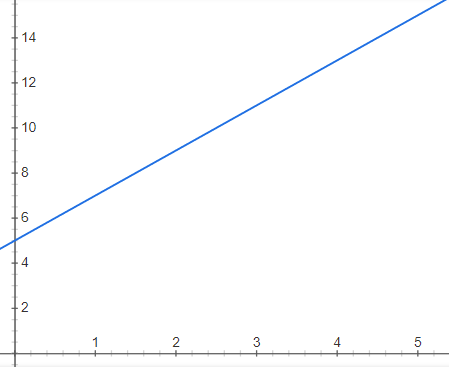
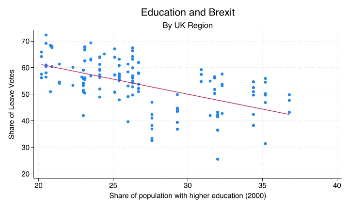

# Regression Analysis: Introduction {.title-left}

------------------------------------------------------------------------

## You'll learn to

::: presenter-space
-   Recognise a **regression equation** as a linear function.
-   Read a **scatterplot with a regression line**.
-   Use a regression equation to generate **predicted values**.
:::

------------------------------------------------------------------------

## Where we left off

::: presenter-space
-   Scatterplots show the relationship between two numeric variables.
-   We added a **line of best fit** (trend line) to summarise that relationship.
-   That line is a **regression line** — and it comes from an equation.
:::

------------------------------------------------------------------------

## Linear functions: the general form

::: presenter-space
$$y = a + bx$$

-   **a** is the **intercept** — the value of y when x = 0.
-   **b** is the **slope** — how much y changes per unit increase in x.
:::

------------------------------------------------------------------------

## A simple example

::: presenter-space
$$y = 5 + 2x$$

{fig-cap="" fig-align="center" width="70%"}

-   If x = 0, y = 5 + 2(0) = **5**
-   If x = 1, y = 5 + 2(1) = **7**
-   If x = 3, y = 5 + 2(3) = **11**
:::

------------------------------------------------------------------------

## A simple example

::: presenter-space
$$y = 5 + 2x$$

{fig-cap="" fig-align="center" width="70%"}

- Each value of x gives us a predicted value of y.
- These predictions trace out a straight line on a plot.
:::

------------------------------------------------------------------------

## A regression equation is a linear function

::: presenter-space
-   Using data, we estimate the intercept and slope that best fit the observations.
-   The result is a linear equation — the same form as y = a + bx.
-   **y** is the **dependent variable**; **x** is the **independent variable**.
:::

------------------------------------------------------------------------

## The Brexit example

::: presenter-space
-   **Research question:** Do areas with more graduates vote differently on Brexit?
-   **y** (dependent): Share of Leave votes (%)
-   **x** (independent): Share of population with higher education (%)
:::

------------------------------------------------------------------------

## Education and Brexit

::: presenter-space

{fig-cap="" fig-align="center" width="90%"}

:::

------------------------------------------------------------------------

## Reading the plot

::: presenter-space
-   Each dot is a **UK region**.
-   x-axis: share of the local population with higher education (2000).
-   y-axis: share of votes cast for Leave in the 2016 referendum.
:::

------------------------------------------------------------------------

## Reading the plot

::: presenter-space
-   The regression line runs through the cloud of dots.
-   The line slopes **downward**: higher education share is associated with lower Leave vote.
-   This is the relationship the regression equation captures.
:::

------------------------------------------------------------------------

## The regression equation

::: presenter-space
$$\widehat{\text{Leave}} = 84 - 1.13 \times \text{HigherEd}$$

-   Intercept ≈ 84
-   Slope ≈ −1.13
:::

------------------------------------------------------------------------

## Generating predictions

::: presenter-space
$$\widehat{\text{Leave}} = 84 - 1.13 \times \text{HigherEd}$$

-   If HigherEd = 20%: 84 − 1.13(20) ≈ **61%** Leave
-   If HigherEd = 30%: 84 − 1.13(30) ≈ **50%** Leave
:::

------------------------------------------------------------------------

## Predictions are approximations

::: presenter-space
-   Look at the scatter: not all regions with HigherEd = 20% voted 61% Leave.
-   Education is not the only factor that shapes the Leave vote.
-   The regression line summarises the **average tendency**, not every dot.
:::

------------------------------------------------------------------------

## Recap

::: presenter-space
-   A regression equation is a **linear function** fitted to data.
-   It has an **intercept** (value of y when x = 0) and a **slope** (change in y per unit x).
-   We use it to generate **predicted values** of y for any value of x.
:::

------------------------------------------------------------------------

::: presenter-space
**Why this matters:**

-   Regression turns a visual pattern in a scatterplot into a precise, testable statement.
-   Everything we do from here builds on this foundation.
:::
