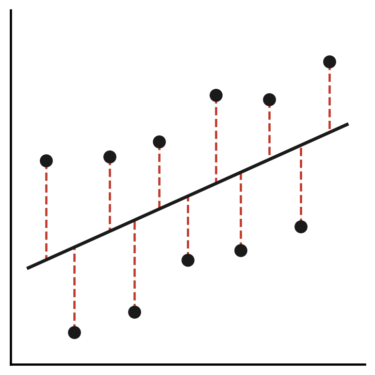
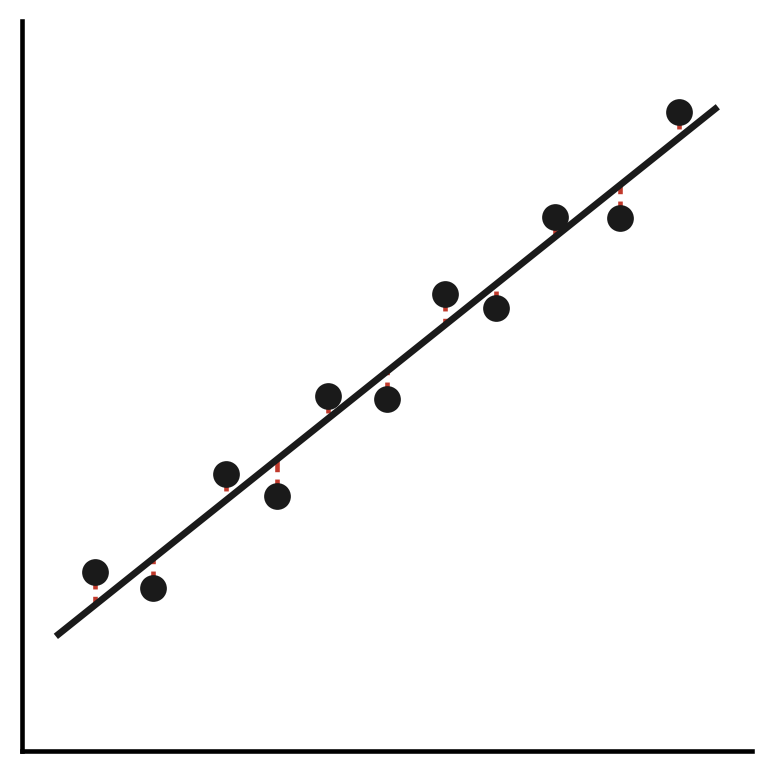

# R-squared {.title-left}

------------------------------------------------------------------------

## You'll learn to

::: presenter-space
-   Define **R-squared** and explain what it measures.
-   Interpret R-squared as a **percentage of explained variance**.
-   Understand what R-squared **does and does not** tell you.
:::

------------------------------------------------------------------------

## What the R-squared measures

::: presenter-space
-   R-squared is the **proportion of variance** in y explained by x.
-   It always lies **between 0 and 1**.
-   Read it as a percentage: R² = 0.30 means **30% of variance explained**.
:::

------------------------------------------------------------------------

## The formula

::: presenter-space
$$R^2 = 1 - \frac{SS_{RES}}{SS_{TOT}}$$

-   $SS_{RES}$: how much the model **misses**.
-   $SS_{TOT}$: how much y **varies in total**.
:::

------------------------------------------------------------------------

## Residual Sum of Squares

::: presenter-space
-   Each residual is the **vertical distance** from a dot to the regression line.
-   We square each distance and sum them all up.
-   Large residuals → model predictions are **often far off**.
:::

------------------------------------------------------------------------

## Total Sum of Squares

::: presenter-space
-   Each observation's distance from the **mean of y**, squared and summed.
-   This is simply the **variance of y** — total spread in the outcome.
-   It is a baseline: how much y varies **without any model**.
:::

------------------------------------------------------------------------

## The logic of the formula

::: presenter-space
$$R^2 = 1 - \frac{SS_{RES}}{SS_{TOT}}$$

-   If the model fits well: $SS_{RES}$ is **small** relative to $SS_{TOT}$.
-   The fraction is close to 0 → R² is **close to 1**.
-   If the model fits poorly: the fraction is close to 1 → R² is **close to 0**.
:::

------------------------------------------------------------------------

## Visual intuition: low R-squared

::: presenter-space

{fig-cap="" fig-align="center" width="30%"}

-   Dots are **widely scattered** around the regression line.
-   $SS_{RES} \approx SS_{TOT}$ → **R² near 0**.
:::

------------------------------------------------------------------------

## Visual intuition: high R-squared

::: presenter-space

{fig-cap="" fig-align="center" width="30%"}

-   Dots cluster **tightly** around the regression line.
-   $SS_{RES} \ll SS_{TOT}$ → **R² near 1**.
:::

------------------------------------------------------------------------

## Brexit example

::: presenter-space
-   In the Leave vote on higher education regression: **R² ≈ 0.30**.
-   About **30%** of the variation in Leave vote share across UK regions is explained by differences in **higher education share**.
:::

------------------------------------------------------------------------

## What the remaining 70% means

::: presenter-space
-   70% of the variation in Leave vote share is **not explained** by education.
-   Other factors matter: economic conditions, age, geography, identity.
-   A bivariate model captures **one piece** of a more complex picture.
:::

------------------------------------------------------------------------

## What R-squared does not mean

::: presenter-space
-   A higher R² does **not** mean the relationship is causal.
-   A low R² does **not** mean the slope is wrong or unimportant.
-   R-squared measures **fit**, not truth.
:::

------------------------------------------------------------------------

## R-squared and statistical significance

::: presenter-space
-   A slope can be **statistically significant** with a low R².
-   Statistical significance: is the slope distinguishable from zero?
-   R-squared: how much of y does the model explain?
:::

------------------------------------------------------------------------

## Recap

::: presenter-space
-   R² = proportion of variance in y explained by x; always between 0 and 1.
-   High R² means good fit; it does **not** imply causality.
:::

------------------------------------------------------------------------

::: presenter-space
**Why this matters:**

-   R-squared tells you how much work your model is doing.
-   Bivariate R² values are often modest — that is expected.
-   Evaluating fit is part of responsible, transparent quantitative research.
:::
