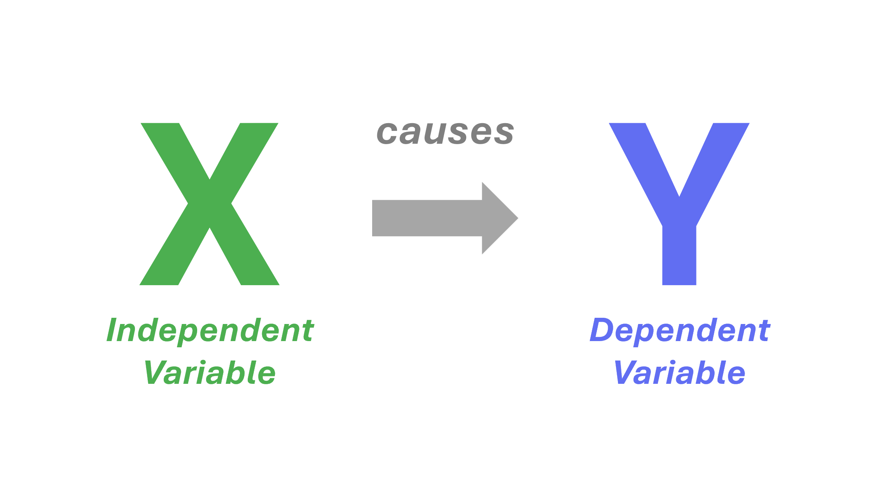
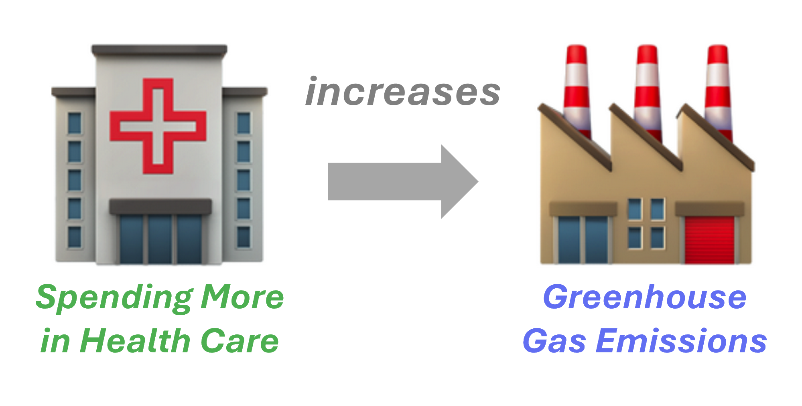
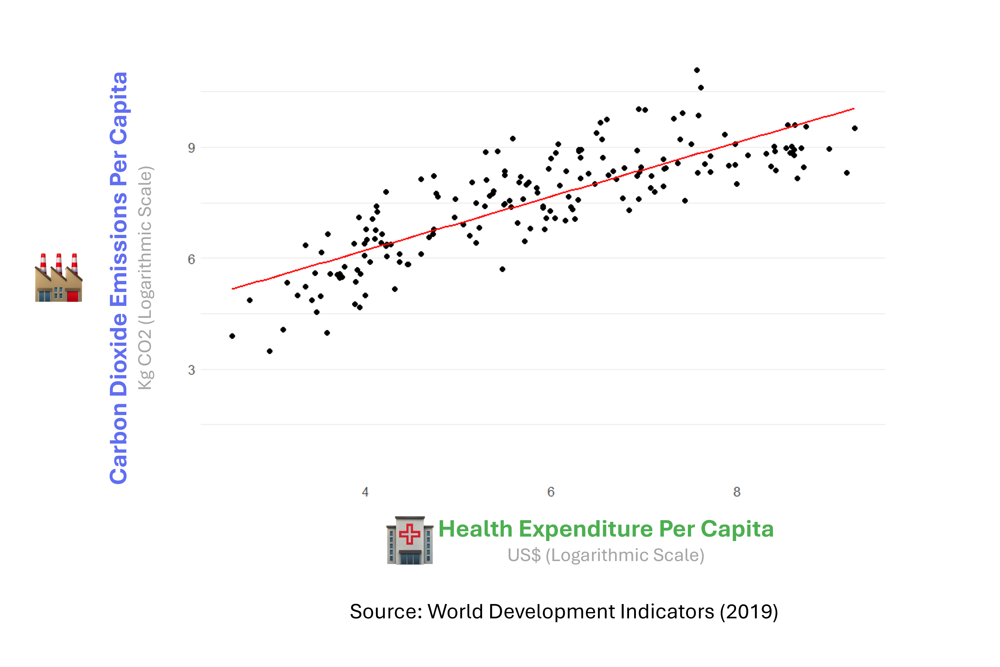
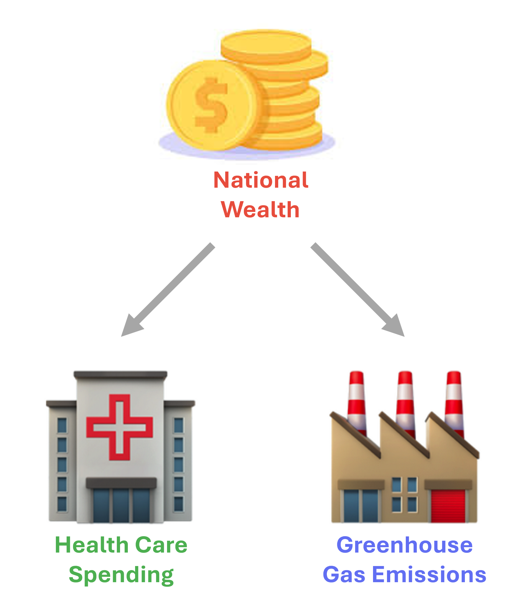

# Confounding Variables {.title-left}

<iframe width="560" height="315" src="https://www.youtube.com/embed/4aucVcaSScg" title="YouTube video player" frameborder="0" allow="accelerometer; autoplay; clipboard-write; encrypted-media; gyroscope; picture-in-picture; web-share" referrerpolicy="strict-origin-when-cross-origin" allowfullscreen></iframe>

------------------------------------------------------------------------

## You'll learn to

::: presenter-space
- Define a confounding variable.
- Explain why correlation doesn't imply causation by referring to confounding variables.
:::

------------------------------------------------------------------------

## Health care spending and greenhouse gas emissions

::: presenter-space
- **Research Question**: Does spending more in health care cause increases in greenhouse gas emissions?
- **Hypothesis:** More health care spending causes greenhouse gas emissions to increase.
:::

------------------------------------------------------------------------

## Hypothesis

:::: nonincremental

::: presenter-space

{fig-cap="" fig-align="center" width="75%"}

:::

::::

------------------------------------------------------------------------

## Hypothesis

:::: nonincremental

::: presenter-space

{fig-cap="" fig-align="center" width="75%"}

:::

::::

------------------------------------------------------------------------

## A positive correlation

:::: nonincremental

::: presenter-space

{fig-cap="" fig-align="center" width="75%"}

:::

::::

------------------------------------------------------------------------

## A positive correlation

:::: nonincremental

::: presenter-space

{fig-cap="" fig-align="center" width="75%"}

:::

::::

------------------------------------------------------------------------

## A confounding variable

:::: nonincremental

::: presenter-space

{fig-cap="" fig-align="center" width="50%"}

:::

::::

------------------------------------------------------------------------

## Definition

::: presenter-space
A **confounding variable**:

- Affects the dependent variable.
- Affects the independent variable.
- Is not a result of the independent variable.

:::

------------------------------------------------------------------------

## Confounders vs. mediators

::: presenter-space
- A **confounder** influences both X and Y from outside the relationship.
- A **mediator** lies on the causal pathway from X to Y.
- Mediators are part of the mechanism — not confounders.
:::

------------------------------------------------------------------------

## An example of the distinction

::: presenter-space
- Does education reduce crime? Possibly via **higher income** (mediator).
- Higher income lies on the pathway: education → income → crime.
- A confounder would affect both education and crime **independently**.
:::

------------------------------------------------------------------------

## Omitted variable bias

::: presenter-space
- When a confounder is **left out** of the analysis, estimates can mislead.
- The relationship between X and Y may appear causal when it is not.
- This is called **omitted variable bias**.
:::

------------------------------------------------------------------------

## Omitted variable bias: the healthcare example

::: presenter-space
- National wealth is omitted → spending appears to **cause** emissions.
- Once wealth is accounted for, the direct relationship may **disappear**.
- This is why bivariate regression is often not enough.
:::

------------------------------------------------------------------------

## Recap

::: presenter-space
- A confounding variable affects both X and Y and is not caused by X.
- Confounders create correlations that can **look causal** but are not.
- Identifying confounders is essential before drawing causal conclusions.
:::

------------------------------------------------------------------------

::: presenter-space
**Why this matters:**

- Most data in political science is observational, not experimental.
- Causal claims in public debate are often based on bivariate correlations.
- Recognising possible confounders is how you read those claims critically.
:::
