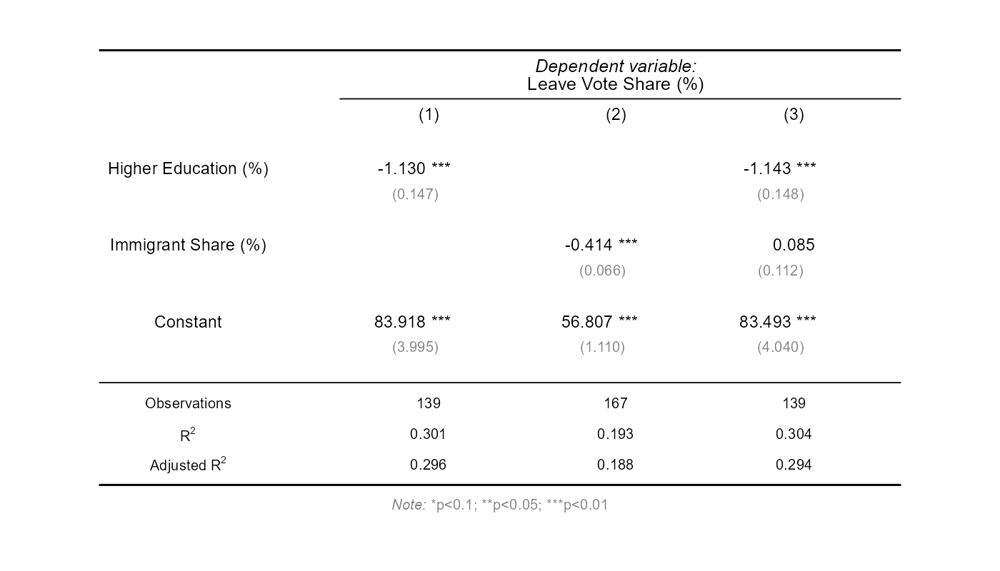
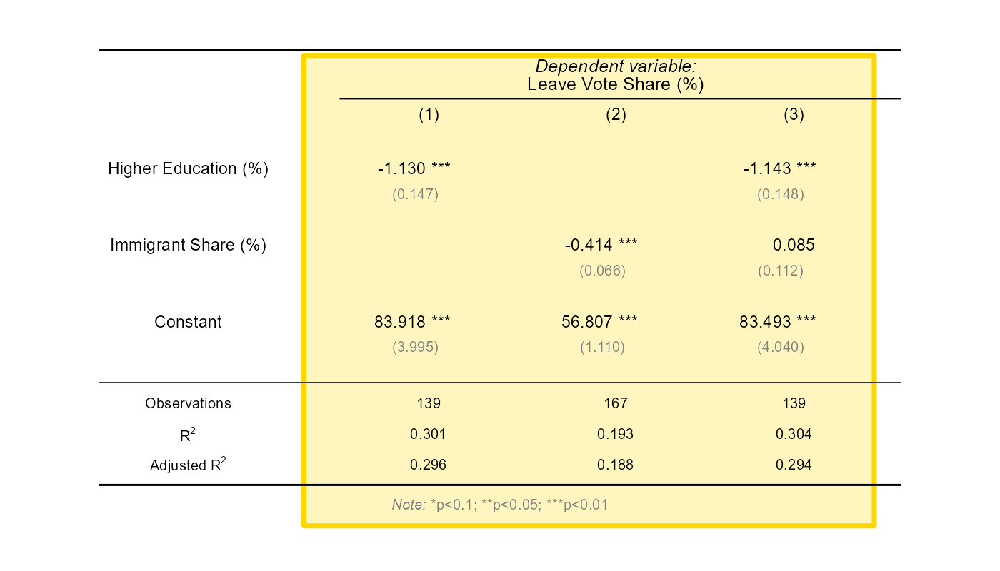
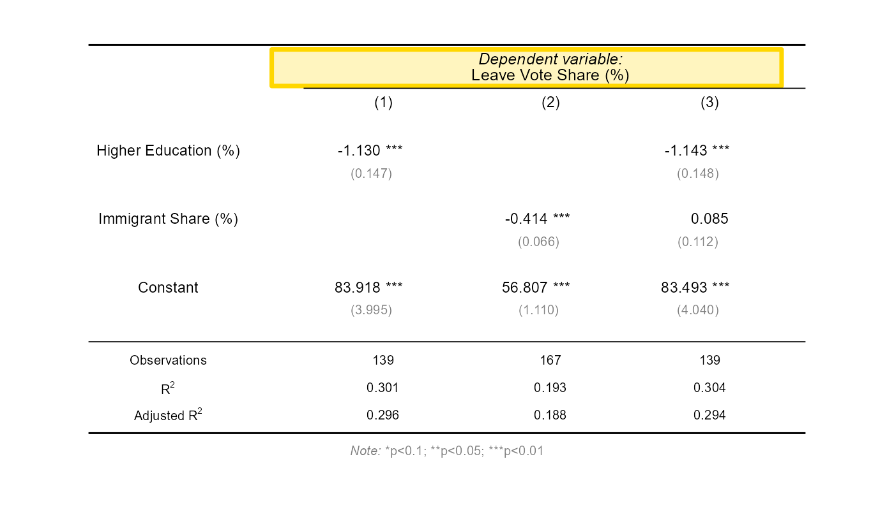
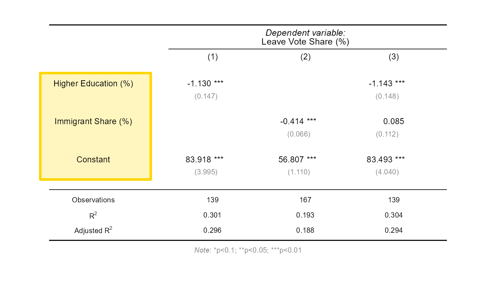
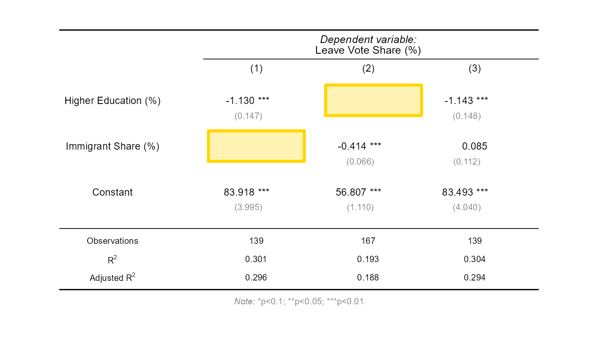
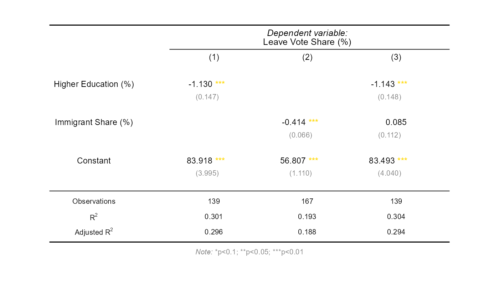
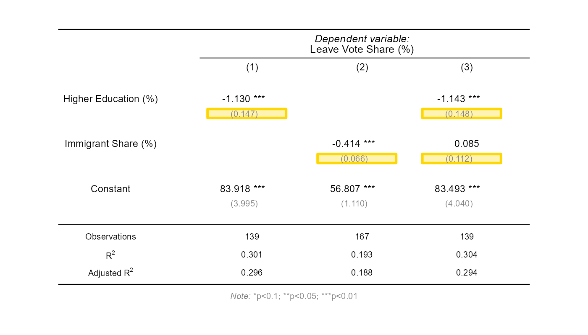
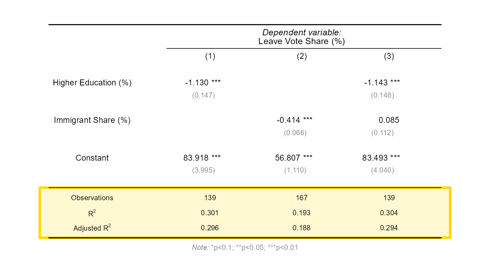

# Reading Regression Tables {.title-left}

------------------------------------------------------------------------

## You'll learn to

::: presenter-space
- Identify the parts of a **publication-style regression table**.
- Read **coefficients, standard errors, and significance stars**.
- Compare **multiple models** presented side by side.
:::

------------------------------------------------------------------------

## Regressions "in the wild"

::: presenter-space
- Regression tables in publications look different from software output.
- They show multiple regressions in a single table.
- This video teaches you how to read them.
:::

------------------------------------------------------------------------

## The full table

:::: nonincremental

::: presenter-space

{fig-cap="" fig-align="center" width="85%"}

:::

::::

::: {.notes}
This table shows three regressions predicting Leave vote share. Each column is a separate model. We will walk through each element.
:::

------------------------------------------------------------------------

## Each column is a model

:::: nonincremental

::: presenter-space

{fig-cap="" fig-align="center" width="85%"}

:::

::::

::: {.notes}
Column (1) regresses Leave share on education alone. Column (2) on immigration alone. Column (3) includes both. Each column is a complete regression.
:::

------------------------------------------------------------------------

## The dependent variable

:::: nonincremental

::: presenter-space

{fig-cap="" fig-align="center" width="85%"}

:::

::::

::: {.notes}
The dependent variable is shown at the top. All three models share the same dependent variable: Leave Vote Share (%).
:::

------------------------------------------------------------------------

## Each row is a variable

:::: nonincremental

::: presenter-space

{fig-cap="" fig-align="center" width="85%"}

:::

::::

::: {.notes}
The left side lists the independent variables: Higher Education, Immigrant Share, and the Constant (intercept). Each row shows how that variable relates to the dependent variable.
:::

------------------------------------------------------------------------

## Blank cells

:::: nonincremental

::: presenter-space

{fig-cap="" fig-align="center" width="85%"}

:::

::::

::: {.notes}
Some cells are blank. Model (1) has no immigration row because it only includes education. Model (2) has no education row. A blank cell means that variable was not included in that model.
:::

------------------------------------------------------------------------

## Stars indicate significance

:::: nonincremental

::: presenter-space

{fig-cap="" fig-align="center" width="85%"}

:::

::::

::: {.notes}
Stars are a shortcut for statistical significance. Three stars (***) means p < 0.01. The note at the bottom of the table defines the thresholds. Notice that immigration in Model (3) has no stars: it is not statistically significant once education is controlled for.
:::

------------------------------------------------------------------------

## Standard errors

:::: nonincremental

::: presenter-space

{fig-cap="" fig-align="center" width="85%"}

:::

::::

::: {.notes}
The numbers in parentheses below each coefficient are standard errors. They measure how precisely the coefficient is estimated. Smaller standard errors mean more precise estimates.
:::

------------------------------------------------------------------------

## The bottom panel

:::: nonincremental

::: presenter-space

{fig-cap="" fig-align="center" width="85%"}

:::

::::

::: {.notes}
The bottom of the table shows summary statistics for each model: the number of observations and R-squared. These help you assess sample size and how much variation the model explains.
:::

------------------------------------------------------------------------

## Recap

::: presenter-space
- Each **column** is a separate regression model.
- **Stars** indicate significance; **parentheses** contain standard errors.
- Comparing columns reveals how coefficients change across models.
:::

------------------------------------------------------------------------

::: presenter-space
**Why this matters:**

- Published research presents results in this format, not as software output.
- Reading regression tables is essential for engaging with quantitative research.
:::
