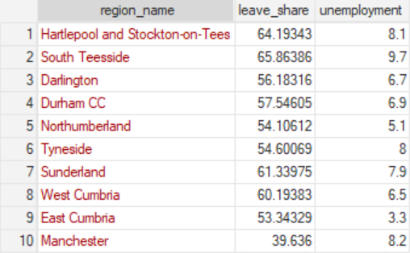
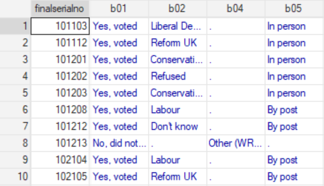
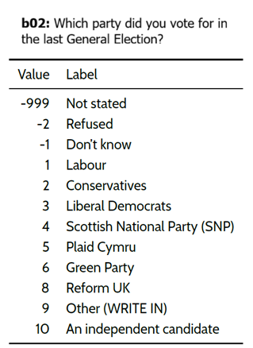

# Datasets and Codebooks {.title-left}

------------------------------------------------------------------------

## You'll learn to

-   Identify how **datasets** are structured.
-   Use a **codebook** to interpret variable meanings, coding schemes, and missing-value conventions.

------------------------------------------------------------------------

## Example 1: Global Competition and Brexit

::: nonincremental

*American Political Science Review* (2018)

:::

------------------------------------------------------------------------

## Example 1: Global Competition and Brexit

{fig-align="center"}

------------------------------------------------------------------------

## Codebooks

- Every good dataset has a **codebook.**
- A codebook provides researchers with **necessary information** about the dataset.

    -   Full explanations of what information the variable carries.
    -   Sources, measurement choices, timespans.
    -   Coding schemes.

------------------------------------------------------------------------

## Codebook example: Global Competition and Brexit

- **eu_15_imm_growth:** growth of immigrants from EU15 countries over 2001-2011. Source: UK Census.
- **share_council_rent:** share of the population in public housing in 2001. Source: UK Census.

------------------------------------------------------------------------

## Example 2: British Election Study

{fig-align="center"}

------------------------------------------------------------------------

## Example 2: British Election Study

{fig-align="center"}

------------------------------------------------------------------------

## Codebook example: British Election Study

::: nonincremental

{fig-align="center"}

:::

------------------------------------------------------------------------

## Recap

- A **dataset** is a table where rows are observations and columns are variables.
- A **codebook** documents what variables mean and how values are coded.
- Working with data involves switching between Stata and documentation.

------------------------------------------------------------------------

**Why this matters:**

- Real-world datasets rarely “explain themselves.”
- Learning to read documentation is a core data-analysis skill.

