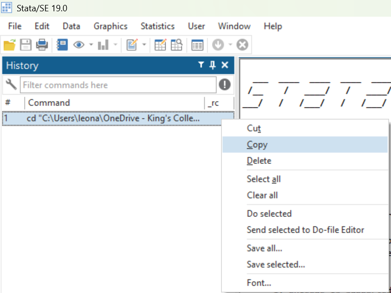
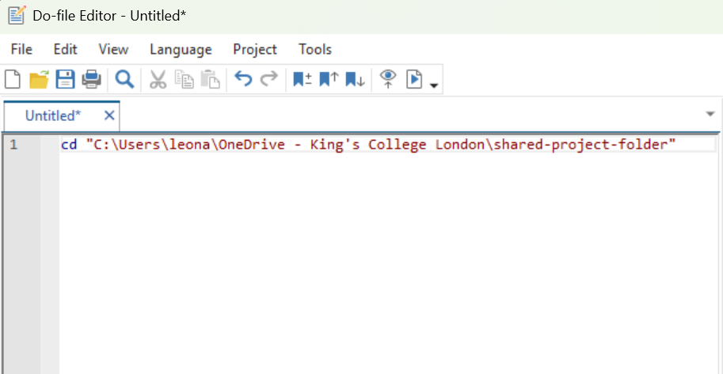

# The Stata Interface {.title-left}

<iframe width="560" height="315" src="https://www.youtube.com/embed/rzjMrTdF9HE?si=Vskmvv-HzVxwGzqD" title="YouTube video player" frameborder="0" allow="accelerometer; autoplay; clipboard-write; encrypted-media; gyroscope; picture-in-picture; web-share" referrerpolicy="strict-origin-when-cross-origin" allowfullscreen></iframe>

<!-- [Watch on YouTube](https://youtu.be/rzjMrTdF9HE) -->

------------------------------------------------------------------------

## You'll learn to

-   **Identify** the different panes in Stata.
-   Set the **working directory** in Stata.
-   Create and save a **do-file**.

------------------------------------------------------------------------

## Step 1: Set up the folder structure

::: nonincremental

-   `my-research-project/`

    -   `data-raw`
    -   `data-clean`
    -   `do`
    -   `output`
    
:::
    
------------------------------------------------------------------------

## Step 1: Set up the folder structure

::: nonincremental

-   `data-raw`

    -   Original data files, never edited.

-   `data-clean`

    -   Cleaned or transformed datasets.

-   `do`

    -   All Stata do-files.

-   `output`

    -   Tables and figures.
    
:::
    
------------------------------------------------------------------------

## Step 2: Open Stata and set the working directory

- The **working directory** is where your project lives.

    - By setting the working directory, you're directing Stata to the folder where your files are stored.

- Go to **File > Change working directory** and select the top-level folder you created for this module.

------------------------------------------------------------------------

## Step 3: Copy from the Command History pane

::: nonincremental

- After you set the **working directory**, Stata registers this action as command in the Command History pane (left-hand side).
- Right-click the first command on the **Command History** pane and click "Copy"

{fig-align="center"}

:::

------------------------------------------------------------------------

## Step 4: Open a new do-file

::: nonincremental

- Click on the **New Do-file** Editor icon (a sheet of paper and a pencil)
- The do-file keeps a **record** of everything you do in Stata.

{fig-align="center"}

:::

------------------------------------------------------------------------

## Step 5: Paste the command into your do-file

::: nonincremental

- In the do-file editor, **paste** the command you copied from the Command History pane.
- Later on, you will be able to set the working directory using the command in this do-file.

{fig-align="center"}

:::

------------------------------------------------------------------------

## Step 6: Save your do-file

::: nonincremental

- From the do-file editor, **save** your do-file in your ``do`` folder.
- Name it ``set-wd.do``
- This do file will be helpful for future work. Keep it.

:::

------------------------------------------------------------------------

## Recap

- The **working directory** is the folder on your computer where your project lives.
- Keeping a **do-file** with a command that sets the working directory will be helpful for future tasks.

------------------------------------------------------------------------

**Why this matters:**

- To open a dataset, we must point Stata to the folder where it is located.
- Setting the working directory makes replicability easier.