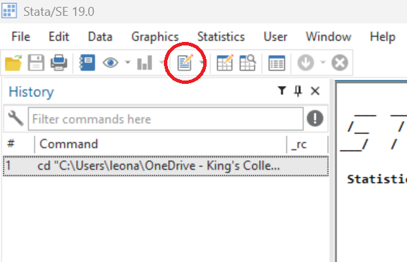
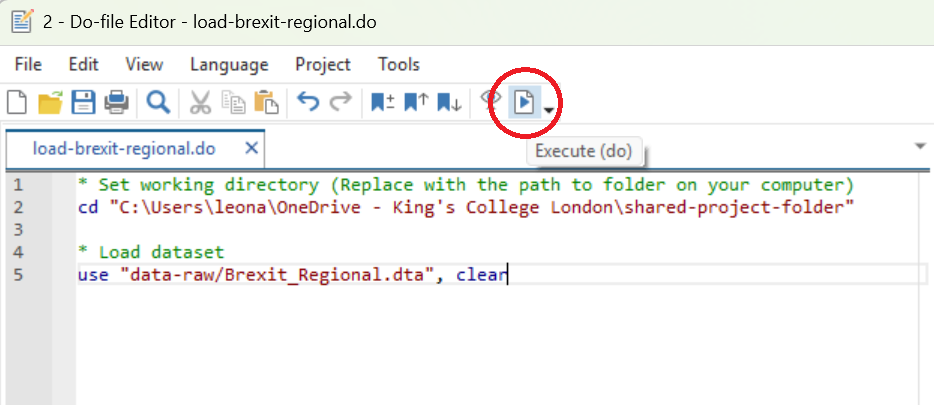
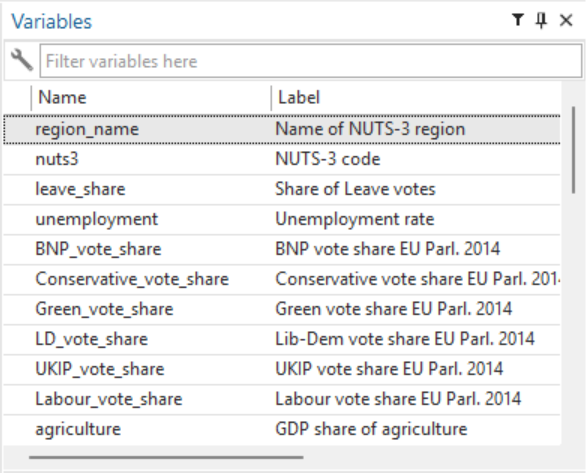
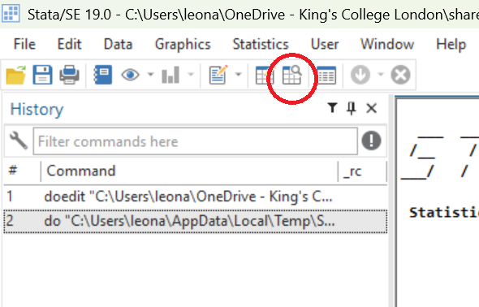

# Loading and Browsing Data {.title-left}

<iframe width="560" height="315" src="https://www.youtube.com/embed/nWJTyqIjYgE?si=xr8674JyN133h8M1" title="YouTube video player" frameborder="0" allow="accelerometer; autoplay; clipboard-write; encrypted-media; gyroscope; picture-in-picture; web-share" referrerpolicy="strict-origin-when-cross-origin" allowfullscreen></iframe>

<!-- [Watch on YouTube](https://youtu.be/nWJTyqIjYgE) -->

------------------------------------------------------------------------

## You'll learn to

-   **Load** a dataset in Stata.
-   **Browse** a dataset by switching between Stata and the codebook.

------------------------------------------------------------------------

## Step 1: Download the Brexit dataset from our shared folder

-   Access our [Shared Project Folder](https://emckclac-my.sharepoint.com/:f:/g/personal/k2588471_kcl_ac_uk/IgCj43BodyKITIiLw6bolCpYAU89x3IK0A2GlVY05aN29UE)
-   Click on ``data-raw``
-   Download ``Brexit_Regional.dta``
-   Save it into the ``data-raw`` folder on your computer

------------------------------------------------------------------------

## Step 2: Set the working directory

-   We've been through this in [The Stata Interface](S03-stata-interface.qmd)
-   This can be done either by clicking File > Change working directory, or...
-   ...if you have saved a do-file (``set-wd.do``) as instructed in [The Stata Interface](S03-stata-interface.qmd), you can copy the command from there.

------------------------------------------------------------------------

## Step 3: Open a new do-file

::: nonincremental

- Click on the "New Do-file Editor" icon (a sheet of paper and a pencil)

{fig-align="center"}

:::

------------------------------------------------------------------------

## Step 4: Set up your do-file to load the dataset

::: nonincremental

- The first line should be the command that sets the working directory. It should look like:

    - ``cd "[Path\To\Your\Folder]"``
    - If you use a Mac, there will be forward slashes instead of back slashes
    
- Below that, enter

    - ``use "data-raw/Brexit_Regional.dta", clear``

:::

------------------------------------------------------------------------

## Step 5: Run the do-file

::: nonincremental

- Click on the sheet of paper with a "Play" button. This will **execute** all commands in the do-file
- In the screenshot, the lines of green text after the asterisks are **comments**. Stata won't run them.

{fig-align="center"}

:::

------------------------------------------------------------------------

## Step 6: Check if it has worked and save your do-file

::: nonincremental

- If you see this on the top-right pane of your Stata screen, it has worked!
- Be sure to **save your do-file** in your ``do`` folder.

{fig-align="center"}

:::

------------------------------------------------------------------------

## Step 7: Browse the data

::: nonincremental

- Click on this icon with magnifying glass. It will allow you to browse the data.
- Explore it while swithing between your Stata screen and the [Codebook](https://emckclac-my.sharepoint.com/:w:/r/personal/k2588471_kcl_ac_uk/_layouts/15/Doc.aspx?sourcedoc=%7BEA160DB5-B57C-4CAC-A10F-5C2B3FC18FB2%7D&file=Brexit_Regional_Codebook.docx&action=default&mobileredirect=true)

{fig-align="center"}

:::

------------------------------------------------------------------------

## Recap

- By setting the **working directory**, we tell Stata where our project lives.
- Once that is done, we can **load datasets** by showing Stata where to find them in the subfolders inside our working directory.
- Once a dataset is loaded, we can browse them using Stata.

------------------------------------------------------------------------

**Why this matters:**

- This exercise allows you to familiarise yourself with how a dataset looks like in Stata.