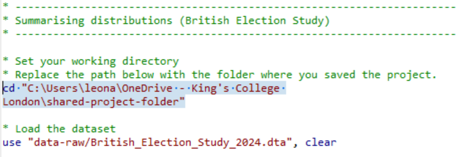
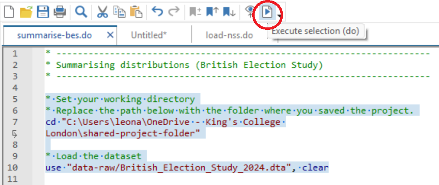
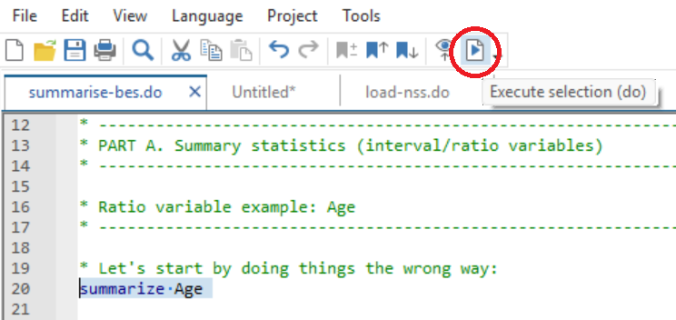

# Summarising Distributions in Stata {.title-left}

<iframe width="560" height="315" src="https://www.youtube.com/embed/GJt35E1ZmXI" title="YouTube video player" frameborder="0" allow="accelerometer; autoplay; clipboard-write; encrypted-media; gyroscope; picture-in-picture; web-share" referrerpolicy="strict-origin-when-cross-origin" allowfullscreen></iframe>

------------------------------------------------------------------------

## You'll learn to

::: nonincremental

-   Produce **summary statistics** and **frequency tables** in Stata and interpret what they show.

::: 

------------------------------------------------------------------------

## Step 1: Download the British Election Study dataset from our shared folder

::: nonincremental

-   Access our [Shared Project Folder](https://emckclac-my.sharepoint.com/:f:/g/personal/k2588471_kcl_ac_uk/IgC7Jh31fuDKQZCWFPMDyHegAXyh48OD-lIbeoHj73LmQHs?e=H4mk5p)
-   Click on ``data-raw``
-   Download ``British_Election_Study_2024.dta``
-   Save it into the ``data-raw`` folder on your computer

::: 

------------------------------------------------------------------------

## Step 2: Download the companion do-file for this activity

::: nonincremental

-   Access our [Shared Project Folder](https://emckclac-my.sharepoint.com/:f:/g/personal/k2588471_kcl_ac_uk/IgC7Jh31fuDKQZCWFPMDyHegAXyh48OD-lIbeoHj73LmQHs?e=H4mk5p)
-   Click on ``do``
-   Download ``summarise-bes.do``
-   Save it into the ``do`` folder on your computer

::: 

------------------------------------------------------------------------

## Step 3: Insert the path to your folder on your computer

::: nonincremental

- This line of ``summarise-bes.do`` has an "address" that only works on my computer.
- Replace it with the "address" to your project folder on your computer.

{fig-align="center"}

:::

------------------------------------------------------------------------

## Step 4: Select the top portion of the do file and click "execute (do)"

::: nonincremental

{fig-align="center"}

:::

------------------------------------------------------------------------

## Step 5: Check if it has worked and save your do-file

::: nonincremental

- If you see this on the top-right pane of your Stata screen, it has worked!
- Be sure to **save your do-file** in your ``do`` folder.

{fig-align="center"}

:::

------------------------------------------------------------------------

## Step 6: Read through the do-file comments and execute the commands

::: nonincremental

- This do-file will serve as your companion for learning how to produce **summary statistics** and **frequency tables**.

{fig-align="center"}

:::

------------------------------------------------------------------------

## Your turn: Find additional variables to summarise

::: nonincremental

- ``summarize`` gives us the **mean** and **standard deviation** (summary statistics).
- ``tabulate`` gives us **frequency tables**.
- Explore the BES data and codebook to look for additional variables to summarise.

:::

------------------------------------------------------------------------

## Recap

- In this video, you learned how to **summarise distributions** in Stata.
- Interpreting output requires checking for non-substantive values and understanding what each statistic represents.

------------------------------------------------------------------------

**Why this matters:**

- Summary statistics and frequency tables help you understand what is typical, what is rare, and whether values make sense.
- They allow you to detect problems in the data before moving on to graphs or statistical models.
