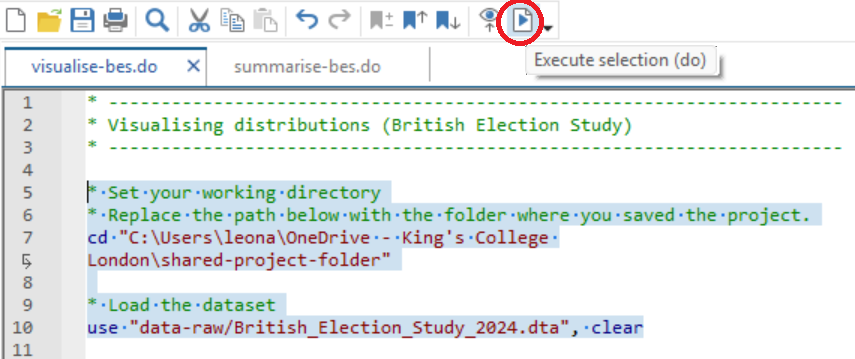
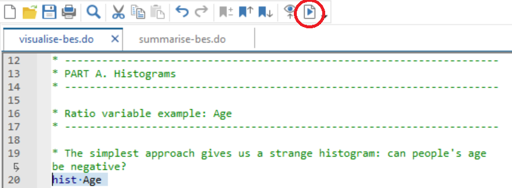
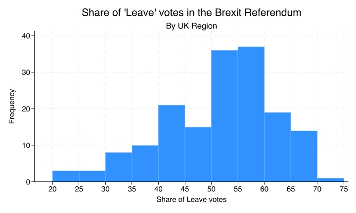

# Bar Charts and Histograms in Stata {.title-left}

------------------------------------------------------------------------

## You'll learn to

::: nonincremental

-   Create **bar charts** and **histograms** in Stata and use them to describe distributions.

:::

------------------------------------------------------------------------

## Step 1: Download the British Election Study dataset from our shared folder

::: nonincremental

-   Access our [Shared Project Folder](https://emckclac-my.sharepoint.com/:f:/g/personal/k2588471_kcl_ac_uk/IgCj43BodyKITIiLw6bolCpYAU89x3IK0A2GlVY05aN29UE)
-   Click on ``data-raw``
-   Download ``British_Election_Study_2024.dta``
-   Save it into the ``data-raw`` folder on your computer

:::

------------------------------------------------------------------------

## Step 2: Download the companion do-file for this activity

::: nonincremental

-   Access our [Shared Project Folder](https://emckclac-my.sharepoint.com/:f:/g/personal/k2588471_kcl_ac_uk/IgCj43BodyKITIiLw6bolCpYAU89x3IK0A2GlVY05aN29UE)
-   Click on ``do``
-   Download ``visualise-bes.do``
-   Save it into the ``do`` folder on your computer

:::

------------------------------------------------------------------------

## Step 3: Insert the path to your folder on your computer

::: nonincremental

- This line of ``visualise-bes.do`` has an "address" that only works on my computer.
- Replace it with the "address" to your project folder on your computer.

{fig-align="center"}

:::

------------------------------------------------------------------------

## Step 4: Select the top portion of the do file and click "execute (do)"

::: nonincremental

{fig-align="center"}

:::

------------------------------------------------------------------------

## Step 5: Check if it has worked and save your do-file

::: nonincremental

- If you see this on the top-right pane of your Stata screen, it has worked!
- Be sure to **save your do-file** in your ``do`` folder.

{fig-align="center"}

:::

------------------------------------------------------------------------

## Step 6: Read through the do-file comments and execute the commands

::: nonincremental

- This do-file will serve as your companion for learning how to produce **histograms** and **frequency bar charts**.

{fig-align="center"}

:::

------------------------------------------------------------------------

## Your turn: Find additional variables to visualise

::: nonincremental

- ``hist`` gives us histograms.
- ``graph hbar (count), over()`` gives us the frequency bar charts.
- Explore the BES data and codebook to look for additional variables to visualise.

:::

------------------------------------------------------------------------

## Got tired of the BES? There's more!

::: nonincremental

- ``histogram-gdp.do`` has the code for this histogram.
- Be sure to download ``Quality_of_Government_2026.dta`` first.
- Explore the **Quality of Government** dataset using the codebook.

{fig-cap="" fig-align="center" width="67%"}

:::

------------------------------------------------------------------------

## Still bored? There's even more!

::: nonincremental

- ``histogram-nss.do`` has the code for this histogram.
- Be sure to download ``National_Student_Survey_2025.dta`` first.
- Explore the **National Student Survey** dataset using the codebook.

{fig-cap="" fig-align="center" width="67%"}

:::

------------------------------------------------------------------------

## Fancy a challenge?

::: nonincremental

- This histogram was made using the **Brexit** dataset.
- Can you reproduce it?

{fig-cap="" fig-align="center" width="67%"}

:::

------------------------------------------------------------------------

## Recap

- **Frequency bar charts** are used for nominal variables and show counts by category.
- **Histograms** are used for ordinal, interval, and ratio variables and show counts within ranges of values.

------------------------------------------------------------------------

**Why this matters:**

- Graphs help us see patterns that are hard to spot in tables alone.
- Choosing the wrong type of graph can hide important features or suggest structure that is not there.
- These skills are essential for interpreting data in research papers, reports, and public debate.