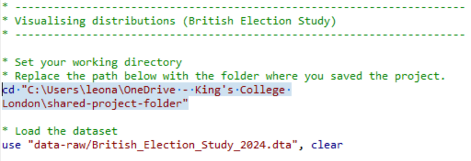
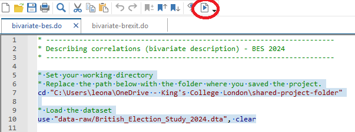
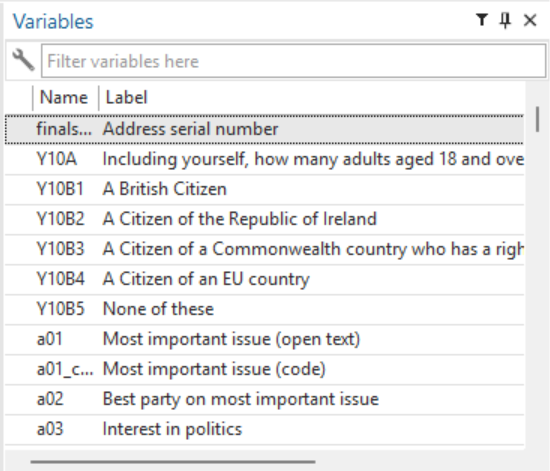

# Describing Correlations in Stata {.title-left}

------------------------------------------------------------------------

## You'll learn to

::: nonincremental

-   Generate and interpret **bivariate summaries** in Stata.

:::

------------------------------------------------------------------------

## Step 1: Download the British Election Study dataset from our shared folder

::: nonincremental

-   Access our [Shared Project Folder](https://emckclac-my.sharepoint.com/:f:/g/personal/k2588471_kcl_ac_uk/IgCj43BodyKITIiLw6bolCpYAU89x3IK0A2GlVY05aN29UE)
-   Click on ``data-raw``
-   Download ``British_Election_Study_2024.dta``
-   Save it into the ``data-raw`` folder on your computer

:::

------------------------------------------------------------------------

## Step 2: Download the companion do-file for this activity

::: nonincremental

-   Access our [Shared Project Folder](https://emckclac-my.sharepoint.com/:f:/g/personal/k2588471_kcl_ac_uk/IgCj43BodyKITIiLw6bolCpYAU89x3IK0A2GlVY05aN29UE)
-   Click on ``do``
-   Download ``bivariate-bes.do``
-   Save it into the ``do`` folder on your computer

:::

------------------------------------------------------------------------

## Step 3: Insert the path to your folder on your computer

::: nonincremental

- This line of ``bivariate-bes.do`` has an "address" that only works on my computer.
- Replace it with the "address" to your project folder on your computer.

{fig-align="center"}

:::

------------------------------------------------------------------------

## Step 4: Select the top portion of the do file and click "execute (do)"

::: nonincremental

{fig-align="center"}

:::

------------------------------------------------------------------------

## Step 5: Check if it has worked and save your do-file

::: nonincremental

- If you see this on the top-right pane of your Stata screen, it has worked!
- Be sure to **save your do-file** in your ``do`` folder.

{fig-align="center"}

:::

------------------------------------------------------------------------

## Step 6: Read through the do-file comments and execute the commands

::: nonincremental

- This do-file will serve as your companion for learning how to describe **bivariate relationships** in Stata.
- The do-file covers **three types** of bivariate analysis, depending on the variable types involved.

:::

------------------------------------------------------------------------

## What is bivariate analysis?

::: nonincremental

- **Univariate** analysis describes one variable at a time.
- **Bivariate** analysis describes relationships between **two variables**.
- The appropriate tool depends on the **types of variables** being analysed.
- Open ``bivariate-bes.do`` to see examples of all three cases.

:::

------------------------------------------------------------------------
## Case 1: Nominal + Nominal

::: nonincremental

- **Example:** Gender and vote choice.
- **Tools:** Cross-tabulation and bivariate bar chart.
- Use ``tabulate`` with ``column`` option for percentages.
- Use ``graph hbar (count)`` with ``over()`` options for grouped bar charts.

:::

::: notes

**Note:** The video uses ``catplot`` for this chart. We have switched to ``graph hbar`` in the do files because ``catplot`` has changed since the video was recorded. The output is equivalent.
  
:::

------------------------------------------------------------------------

## Case 2: Nominal + Numeric

::: nonincremental

- **Example:** Newspaper readership and ideology.
- **Tools:** Compare means and bar chart of means.
- Use ``by``: ``summarize`` to calculate group means.
- Use ``graph hbar`` with ``over()`` to visualise differences.

:::

------------------------------------------------------------------------

## Case 3: Numeric + Numeric

::: nonincremental

- **Example:** Import shock and Brexit vote share.
- **Tools:** Scatterplot and regression line.
- Use ``twoway (scatter)`` to plot individual observations.
- Add ``(lfit)`` to overlay the regression line.

:::

------------------------------------------------------------------------

## Interpreting scatterplots and regression lines

::: nonincremental

- The **scatterplot** shows individual data points.
- The **regression line** summarises the overall pattern.
- **Direction:** Upward slope = positive association; downward slope = negative association.
- **Strength:** Points clustered near the line = strong; widely scattered = weak.

:::

------------------------------------------------------------------------

## Your turn: Explore bivariate relationships

::: nonincremental

- Open ``bivariate-bes.do`` and work through all three cases.
- Download ``bivariate-brexit.do`` for additional scatterplot examples.
- Use the BES and Brexit codebooks to explore other variables.
- Try modifying the commands to answer your own research questions.

:::

------------------------------------------------------------------------

## Recap

- **Cross-tabulations** and **grouped bar charts** describe associations between nominal variables.
- **Bar charts of means** summarise differences in a numeric variable across categories.
- **Scatterplots** and **regression lines** summarise relationships between two numeric variables.

------------------------------------------------------------------------

**Why this matters:**

- Describing relationships between variables is the foundation for asking why those relationships exist.
- Choosing the wrong tool for the wrong variable types produces meaningless or misleading output.
- These skills are essential for interpreting bivariate analyses in research papers, reports, and public debate.